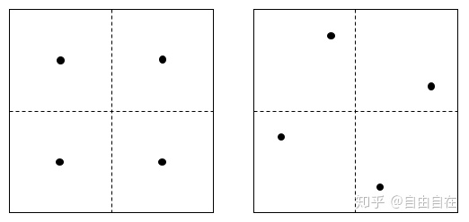

## 空间变换

### 局部坐标系

以给定向量n为局部空间Z轴，构建Z轴向上的局部坐标系。则在世界空间中，给定向量n若偏向于Y轴则映射到YZ平面，若偏向于X轴则映射到XZ平面。按照右手螺旋定则，我们可以在二维平面直接得到对应的垂直向量t，再使用n叉乘t得到s。

```cpp
Frame(const Vector3f& z) : n(z) {
    if (std::abs(n.x) > std::abs(n.y)) {
        t = Normalize(Vector3f(-n.z * invLen, 0.0f, n.x * invLen));
    } else {
        t = Normalize(Vector3f(0.0f, n.z * invLen, -n.y * invLen));
    }
    s = Cross(n, t);
}
```

对于要转换到局部空间的世界空间向量，需要进行stn矩阵变换。本质上就是计算世界空间向量在stn三个向量上的投影，等价于与stn分别进行点乘。

```cpp
Vector3f ToLocal(const Vector3f& v) const {
    return {Dot(v, s), Dot(v, t), Dot(v, n)};
}
```

对于要转换到世界空间的局部空间向量，则需要进行stn的逆变换。显然stn矩阵是一个正交矩阵，所以其逆矩阵等价于其转置矩阵。因此对局部空间变量进行stn矩阵逆变换等价于于stn分别相乘后再累加。

```cpp
Vector3f ToWorld(const Vector3f& v) const {
    return s * v.x + t * v.y + n * v.z;
}
```

### 切线空间
TBN矩阵也是一个局部坐标系，是模型顶点根据切线和法线构造的正交的切线空间。设三角形边E1和E2。取三角形上一点的切线T与副切线B，映射到三维空间有以下关系：

$$
\begin{array}{l}
E_{1}=\Delta U_{1} T+\Delta V_{1} B 
\\\\
E_{2}=\Delta U_{2} T+\Delta V_{2} B
\end{array}
$$

其中的的Δu和Δv是顶点之间uv差值。
经过计算我们可以得到切线和副切线在三维空间中的映射：
$$
\begin{array}{l}
T=\frac{\Delta V_{1} E_{2}-\Delta V_{2} E_{1}}{\Delta V_{1} \Delta U_{2}-\Delta V_{2} \Delta U_{1}} 
\\\\
B=\frac{-\Delta U_{1} E_{2}+\Delta U_{2} E_{1}}{\Delta V_{1} \Delta U_{2}-\Delta V_{2} \Delta V_{1}}
\end{array}
$$

### 施密特正交化

施密特正交化可以由非线性相关的一组向量 $(\alpha_1,\alpha_2,\alpha_3)$ 构造出互相正交的一组向量 $(\beta_1,\beta_2,\beta_3)$ 。再对构造出的向量进行归一化就得到了一组单位基向量 $(\gamma_1,\gamma_2,\gamma_3)$ 。施密特正交化的几何意义就是减去除了与之垂直的所有分量值，剩下的就只有垂直分量了。
$$
\begin{aligned}
\beta_1 &= \alpha_1
\\
\beta_2 &= \alpha_2 - \frac{(\alpha_2,\beta_1)}{(\beta_1,\beta_1)} \beta_1
\\
\beta_3 &= \alpha_3 - \frac{(\alpha_3,\beta_1)}{(\beta_1,\beta_1)} \beta_1 - 
\frac{(\alpha_3,\beta_2)}{(\beta_2,\beta_2)} \beta_2
\end{aligned}
$$

$$
\gamma_1 = \frac{\beta_1}{||\beta_1||}
,

\gamma_2 = \frac{\beta_2}{||\beta_2||}
,
\gamma_3 = \frac{\beta_3}{||\beta_3||}
$$


从模型中读取顶点的法线N，根据施密特正交化法则我们可以得到与法线N正交的切线。然后可以进一步正交化求出副切线或者直接叉乘得到副切线。
$$
\begin{array}{l}
T_{\perp}=\operatorname{Normalize}(T-(T \cdot N) * N)
\\\\
B_{\perp}=\operatorname{Normalize}(B-(B \cdot N) * N - (B \cdot T_{\perp})*T_{\perp} )
\\\\
B_{\perp}=N \times T_{\perp}
\end{array}
$$

以上得出的是将切线空间法线贴图中得到的法线变换到世界空间的 TBN 矩阵，如果用模型空间法线建立切线空间则变换的结果是模型空间法线。如果要在切线空间中运算，只需要将世界空间法线左乘 TBN 矩阵的逆矩阵即可。而TBN矩阵是一个正交矩阵，其逆矩阵等于其转置矩阵。
$$
M_{T B N}=\left(\begin{array}{cccc}
T_{x} & T_{y} & T_{z} & 0 \\
B_{x} & B_{y} & B_{z} & 0 \\
N_{x} & N_{y} & N_{z} & 0 \\
0 & 0 & 0 & 1
\end{array}\right)
$$

### 旋转变换

对于二维平面上以O为圆心、半径为1的单位圆，已知圆上任意一点$A(x_1,y_1)$。设OA与x轴夹角为a，其坐标为$A(\cos{a}，\sin{a})$。再取圆上任意一点B(x2,y2)，它是A点沿圆旋转b°后得到的。则OB与x轴夹角为a+b，其坐标为B(cos(a+b)，sin(a+b))。

由三角函数公式可得：

$$
\cos{(a+b)}=\cos{a} \cdot \cos{b}-\sin{a} \cdot \sin{b}
\\\\
\sin{(a+b)}=\sin{a} \cdot \cos{b}+\cos{a} \cdot \sin{b}
$$

由于A点坐标是已知的，带入A(x1,y1)可得线性方程组，可转为矩阵形式。

$$
x_2=\cos{b} \cdot x_1 - \sin{b} \cdot y_1
\\\\
y_2=\sin{b} \cdot x_1 + \cos{b} \cdot y_1
$$

$$
\begin{bmatrix}  
  x_2 \\  
  y_2   
\end{bmatrix} 
=
\begin{bmatrix}  
  \cos{b} & -\sin{b} \\  
  \sin{b} & \cos{b}  
\end{bmatrix} 
\cdot
\begin{bmatrix}  
  x_1 \\  
  y_1   
\end{bmatrix} 
$$

三维的绕XYZ轴旋转实际上就是固定了一轴的二维旋转，因此推广到三维空间后，被绕的轴为单位向量，其他轴上的该维度分量为0。按照叉乘的方向为旋转的方向，其中绕Y轴旋转是从Z轴旋转到X轴。映射时需要注意此时Z-3D轴映射到了X-2D轴，X-3D轴映射到了Y-2D，所以绕Y轴旋转矩阵看起来时调换了符号。

$$
\left[
\begin{array}{ccc}
1 & 0 & 0 \\
0 & \cos \alpha & -\sin \alpha\\
0 & \sin \alpha & \cos \alpha 
\end{array}\right]
,
\left[\begin{array}{ccc}
\cos \alpha & 0 & \sin \alpha\\
0 & 1 & 0  \\
-\sin \alpha & 0 & \cos \alpha
\end{array}\right]
,
\left[\begin{array}{ccc}
\cos \alpha & -\sin \alpha & 0  \\
\sin \alpha & \cos \alpha & 0  \\
0 & 0 & 1 
\end{array}\right]
$$

特征值是一个标量，衡量线性变换对空间的拉伸或缩短的值。特征向量不被线性变换改变它的方向，而旋转矩阵的特征向量就是旋转的轴。旋转矩阵不会对空间进行拉伸，其特征值为1。对于二阶旋转矩阵，在其特征向量的方向上进行伸缩变换。

### TRS分解

平移向量可以从第四列中直接读取

由于旋转矩阵是正交矩阵，因此旋转矩阵的逆为旋转矩阵的转置，而缩放矩阵是一个对角线矩阵，其转置矩阵为其自身。
$$
(RS)^TRS= S^TR^TRS=SR^{-1}RS=SIS
$$
因此取变换矩阵的坐上3x3子矩阵A的乘以其转置矩阵即得到缩放向量的平方$AA^T=SS$。得到S矩阵后使3x3子矩阵除以缩放矩阵即可得到旋转矩阵$R=A/S$。实际上，相比复杂的矩阵乘法，是与直接计算3x3矩阵的列向量长度等价的。

### *四元数

万向死锁

### 齐次坐标

为了处理平移变换，将旋转和平移合并为4x4的矩阵，三维向量$(x,y,z)$也需要增加一个维度$(x,y,z,w)$。

$$
\left[\begin{array}{llll}
1 & 0 & 0 & 1 \\
0 & 1 & 0 & 1 \\
0 & 0 & 1 & 1 \\
0 & 0 & 0 & 1
\end{array}\right]\left[\begin{array}{l}
2 \\
3 \\
4 \\
1
\end{array}\right]=\left[\begin{array}{l}
3 \\
4 \\
5 \\
1
\end{array}\right]
$$

### 法线变换

法线经过和顶点相同的模型变换往往得不到正确的垂直于三角面的法线，因此我们需要找到使法线正确变换到世界空间的变换矩阵。

> 由于法线是一个方向矢量没有起点，因此我们可以直接截取模型变换矩阵左上角的 $3 \times 3$ 子矩阵作为模型变换矩阵 $M$ 。

设三角形 $\triangle ABC$ 的切线 $T = A-B$ ，其垂直于面法线 $N$ 。且切线 $T$ 经过模型变换后为 $T^{\prime}$ 应仍然垂直变换后法线 $N^{\prime}$ 。
$$
\vec{N}^{\prime} \cdot \vec{T}^{\prime}
= 0
\\
(G \vec{N} )  \cdot  (M \vec{T} )
= 0
$$
设法线经过的变换矩阵为 $G$ 。而向量的点积就是向量各维度分量乘积的和，因此可以将点积转换为前一个列向量转置为行向量再和后一个列向量进行分量相乘运算。
$$
( G \vec{N})^T * (M \vec{T} )
= 0
\\
\vec{N}^TG^TM \vec{T}
=0
$$


切线 $T$ 应始终垂直于法线 $N$ ，切线 $T$ 经过变换 $G^TM$ 应没有发生变化，即 $G^TM$ 为单位矩阵 $E$ 。

如果模型变换矩阵 $M$ 的缩放变换是均匀的，那么模型变换矩阵 $M$ 就是一个可逆的旋转矩阵，因此法线 $N$ 经过的法线变换 $G$ 就是模型变换矩阵 $M$ 逆矩阵的转置。

注意，经过变换的法线 $N$ 不能保证其仍然是单位长度，因此需要对法线重新归一化。但如果模型变换矩阵只包含了旋转变换，则法线变换矩阵 $G$ 就是模型变换矩阵 $M$ ，此时无需对法线进行归一化。
$$
G^TM = E
\\
G^T=M^{-1}
\\
G = (M^{-1})^{T}
$$

### 视图变换

设定摄像机位置为 $e$ ，垂直向上的向量为 $t$ ，观察方向为 $g$ 。则世界空间坐标变换到相机空间则需要做和相机相反的位移。

$$
\left[\begin{array}{cccc}
1 & 0 & 0 & -x_{e} \\
0 & 1 & 0 & -y_{e} \\
0 & 0 & 1 & -z_{e} \\
0 & 0 & 0 & 1
\end{array}\right]
$$

在右手坐标系中，我们约定相机看向世界空间的 $- z$ 轴，并构建正交坐标系，得到 $g \times t$。据此可以直接写出变换矩阵为

$$
\left[\begin{array}{cccc}
x_{\hat{g} \times \hat{t}} & x_{t} & x_{-g} & 0 \\
y_{\hat{g} \times \hat{t}} & y_{t} & y_{-g} & 0 \\
z_{\hat{g} \times \hat{t}} & z_{t} & z_{-g} & 0 \\
0 & 0 & 0 & 1 
\end{array}\right]
$$

对于世界空间坐标，其需要做逆变换，而旋转变换是正交变换，其逆矩阵就等于其转置矩阵，因此可以直接得出相机变换的旋转矩阵。

$$
\left[\begin{array}{cccc}
x_{g \times t} & y_{g \times t} & z_{g \times t} & 0 \\
x_{t} & y_{t} & z_{t} & 0 \\
x_{-g} & y_{-g} & z_{-g} & 0 \\
0 & 0 & 0 & 1
\end{array}\right]
$$

最终完整的观察矩阵可以化简为

$$
\left[\begin{array}{cccc}
x_{g \times t} & y_{g \times t} & z_{g \times t} & -e \cdot {(g \times t)} \\
x_{t} & y_{t} & z_{t} & -e \cdot \ t \\
x_{-g} & y_{-g} & z_{-g} & -e \cdot g \\
0 & 0 & 0 & 1
\end{array}\right]
$$

### 正交投影变换

View Space 在对称情形下，$r$ 和 $l$ ，$t$ 和 $b$ 可以相互抵消，并且实际上一般都是对称的。

正交投影变换可以分解为位移变换和缩放变换。首先进行位移变换，将 View Space 移动到观察空间的坐标系原点。然后再进行缩放变换，将 View Space 的长宽高变换为 $[-1,1]$ 的范围，即标准立方体。此时称为齐次裁剪空间。经过齐次裁剪，再对坐标进行透视除法，才变换到 NDC 空间。

$$
\left[\begin{array}{cccc}
\frac{2}{r-l} & 0 & 0 & 0 \\
0 & \frac{2}{t-b} & 0 & 0 \\
0 & 0 & \frac{2}{f-n} & 0 \\
0 & 0 & 0 & 1
\end{array}\right]
\left[\begin{array}{cccc}
1 & 0 & 0 & -\frac{r+l}{2} \\
0 & 1 & 0 & -\frac{t+b}{2} \\
0 & 0 & 1 & -\frac{f+n}{2} \\
0 & 0 & 0 & 1
\end{array}\right]
=
\left[\begin{array}{cccc}
\frac{2}{r-l} & 0 & 0 & -\frac{r+l}{r-l} \\
0 & \frac{2}{t-b} & 0 & -\frac{t+b}{t-b} \\
0 & 0 & \frac{2}{f-n} & -\frac{f+n}{f-n} \\
0 & 0 & 0 & 1
\end{array}\right]
$$

$$
\left[\begin{array}{cccc}
\frac{1}{r} & 0 & 0 & 0 \\
0 & \frac{1}{t} & 0 & 0 \\
0 & 0 & \frac{2}{f-n} & 0 \\
0 & 0 & 0 & 1
\end{array}\right]
\left[\begin{array}{cccc}
1 & 0 & 0 & 0 \\
0 & 1 & 0 & 0 \\
0 & 0 & 1 & -\frac{f+n}{2} \\
0 & 0 & 0 & 1
\end{array}\right]
=
\left[\begin{array}{cccc}
\frac{1}{r} & 0 & 0 & 0 \\
0 & \frac{1}{t} & 0 & 0 \\
0 & 0 & \frac{2}{f-n} & -\frac{f+n}{f-n} \\
0 & 0& 0 & 1
\end{array}\right]
$$

### 透视投影变换

透视投影变换需要先将截锥体形状的 View Space 挤压成长方体形状的的 View Space 后，再进行正交投影变换。将该矩阵和正交投影矩阵左乘后即可得到完整的透视投影矩阵。

$$
M_{persp \rightarrow ortho}
=
\left(\begin{array}{cccc}
n & 0 & 0 & 0 \\
0 & n & 0 & 0 \\
0 & 0 & -(n+f) & -nf\\
0 & 0 & 1 & 0
\end{array}\right)
$$

$$
M_{persp} 
=
\left(\begin{array}{cccc}
\frac{2 n}{r-l} & 0 & -\frac{r+l}{r-l} & 0 \\
0 & \frac{2 n}{t-b} & -\frac{t+b}{t-b} & 0 \\
0 & 0 & -\frac{f+n}{f-n} & -\frac{2 f n}{f-n} \\
0 & 0 & -1 & 0
\end{array}\right)
=
\left(\begin{array}{cccc}
\frac{n}{r} & 0 & 0 & 0 \\
0 & \frac{n}{t} & 0 & 0 \\
0 & 0 & -\frac{f+n}{f-n} & -\frac{2 f n}{f-n} \\
0 & 0 & -1 & 0
\end{array}\right)
$$

三维向量$(x,y,z)$中的z分量代表了该坐标与相机的距离。在透视投影中物体是近大远小的，这意味着离相机越远即z分量越大，显得越小。即与1/z正相关。通过如下形式的4x4矩阵，我们可以将坐标的z分量保存到投影后的齐次坐标w中，因此w的几何含义就是投影的距离，当w增大时，坐标被拉伸，w减小时，坐标被压缩。w对三维坐标起到缩放的作用。远处的坐标的w也就是变换前的z是更大的，被压缩的更多，也就符合我们的近大远小的需求。

$$
\left[\begin{array}{llll}
1 & 0 & 0 & 0 \\
0 & 1 & 0 & 0 \\
0 & 0 & 1 & 0 \\
0 & 0 & 1 & 0
\end{array}\right]\left[\begin{array}{l}
2 \\
3 \\
4 \\
1
\end{array}\right]=\left[\begin{array}{l}
2 \\
3 \\
4 \\
4
\end{array}\right]
$$

齐次空间裁剪（Homogeneous Clipping Space）可以更细粒度地将视锥体外的三角形剔除，

### 透视除法

对于坐标点$(x,y,z,1)$，假设经过透视投影变换后为$(x',y',z',w')$，其中$w'=z_{view}$。

透视除法变换到$[-1,1]×[-1,1]×[0,1]$的NDC空间$(\frac{x'}{w},\frac{y'}{w},\frac{z'}{w})$。则在透视除法前有
$$
\left\{\begin{matrix} 
-w<x'<w\\\\
-w<y'<w\\\\
0<z'<w
\end{matrix}\right.
$$

W的含义

w=1&w=0&w<0

z分量代表了该坐标与相机的距离。在透视投影中物体是近大远小的，这意味着离相机越远即z分量越大，显得越小。投影变换矩阵的目的是在w分量保留变换前的z分量


如果有顶点在近平面后，则导致w'<0，进行透视除法时会使得其xy坐标翻转， 


如果顶点恰好在视点平面上，则会导致除0错误。在透视除法前将不符合以上条件的顶点剔除、裁剪后可以避免除零错误。


将视锥体上的三角形裁剪为新三角形。但裁剪新三角形的操作是比较麻烦的事情，在光栅化时通过视口和平面方程来裁剪超出屏幕范围的部分会更容易。

对于有顶点落在视点平面z=0的三角形，要么直接剔除，要么进行裁剪。避免出现除零错误。

### NDC空间

NDC空间的坐标是由齐次裁剪空间坐标经过透视除法得到的。而齐次裁剪空间坐标是由相机空间经过投影变换后得到的，因此我们可以得到相机空间坐标和NDC空间坐标的关系。此外，进行投影变换之前的相机空间坐标的w分量都是为1的。根据以上信息可以推导出相机空间坐标由NDC空间坐标做逆投影变换后再除以其w得到。
$$
\left\{\begin{array}{ l }
V_{\text {view }}  =M_{\text {project }}^{-1} * V_{\text {ndc }} * w_{\text {clip }} \\\\
1  =\left(M_{\text {project }}^{-1} * V_{\text {ndc }}\right).w * w_{\text {clip }} 
\end{array}\right.
\Rightarrow
v_{\text{view}} = M_{\text{project}}^{-1} *   v_{\text{ndc}} * \frac{1}{(M_{\text{project}}^{-1} \cdot  v_{\text{ndc}}).w}
$$

### 视口变换

设定近平面和远平面的数值 $n,f $ 为正数。取垂直视场角 $fov$ 的一半做正切，即最高参数 $t$ 与最近参数 $n$ 的比值。再通过屏幕宽高比即可得出最右参数 $r$ 。
$$
\tan{\frac{fov}{2}} = \frac{t}{n}
\\
\\
r = t \times \frac{w}{h}
$$

### 重心坐标

三角形 $\triangle ABC$ 所在平面任一点 $P$ 与顶点 $A$ 组成的边，都可以由三角形 $\triangle ABC$ 两边的线性组合表示，进一步地拆分该表达式，可以得到三角形所在平面任一点 $P$ 可由三角形 $\triangle ABC$ 地三个顶点组成的线性组合，其系数即所谓的重心坐标。
$$
{A P}=u {A B}+v {A C}
\\
A-P=u(A-B)+v(A-C)
\\
P=(1-u-v) A+u B+v C
$$

将由三角形 $\triangle ABC$ 两边的线性组合表示 $AP$ 的表达式变形为向量乘法，即可得到两向量点乘为 $0$ 的结果。
$$
u {A B}+v {A C}+{P A}=0
$$

$$
\left[\begin{array}{l}
u \\
v \\
1
\end{array}\right]
\cdot
\left[\begin{array}{l}
{A B_{x}} \\
{A C}_{x} \\
{P A_{x}}
\end{array}\right]=0
$$

$$
\left[\begin{array}{l}
u \\
v \\
1
\end{array}\right]
\cdot
\left[\begin{array}{l}
{A B_{y}} \\
{A C}_{y} \\
{P A_{y}}
\end{array}\right]=0
$$

两向量点乘为 $0$ ，则互相垂直，因此向量 $[u,v,1]^T$ 与后两者分别是垂直的。由叉乘的性质又可知，通过后两者叉乘就可以得垂直于两者得向量 $[u,v,1]^T$ 。
$$
\left[\begin{array}{l}
{A B_{x}} \\
{A C}_{x} \\
{P A_{x}}
\end{array}\right]
\times
\left[\begin{array}{l}
{A B_{y}} \\
{A C}_{y} \\
{P A_{y}}
\end{array}\right]
=
\left[\begin{array}{l}
u \\
v \\
1
\end{array}\right]
$$
还可以通过直接计算的方式求出重心坐标。
$$
\begin{aligned}
\alpha &=\frac{-\left(x-x_{B}\right)\left(y_{C}-y_{B}\right)+\left(y-y_{B}\right)\left(x_{C}-x_{B}\right)}{-\left(x_{A}-x_{B}\right)\left(y_{C}-y_{B}\right)+\left(y_{A}-y_{B}\right)\left(x_{C}-x_{B}\right)} \\
\beta &=\frac{-\left(x-x_{C}\right)\left(y_{A}-y_{C}\right)+\left(y-y_{C}\right)\left(x_{A}-x_{C}\right)}{-\left(x_{B}-x_{C}\right)\left(y_{A}-y_{C}\right)+\left(y_{B}-y_{C}\right)\left(x_{A}-x_{C}\right)} \\
\gamma &=1-\alpha-\beta
\end{aligned}
$$

### 透视插值校正

在相机空间下，经过透视投影后的物体看起来是近大远小的。但是我们计算重心坐标时却是在屏幕空间计算，所以计算的结果不会考虑到近大远小。


对于硬件，无论采用什么投影方式，都是在顶点着色器中输出一个顶点坐标，统一都会做透视除法。

设点$P (x,y,z) = αA(x1,y1,z1)+βB(x2,y2,z2)$，其中$ α+β=1,α=1-n,β-n$。
则该点在屏幕上映射为
$P'(x',y',z') = α'A'+β'B'$，其中$ α'+β'=1, α'=1-m,β'=m$。
根据三角形相似原理
$$
α:β = (α'/z1): (β'/z2)
$$
推广到三维
$$
α:β:γ = (α'/z1): (β'/z2):(γ'/z3)
$$

## 基于物理的渲染

### Phong 光照模型

入射光线从入射点向半球面各个方向反射，且不同方向反射强度均匀相等。

对于入射光，需要考虑其入射角度造成接收到的入射光强度的损失。

并随着距离的增加，单位面积接收到光线的强度会平方衰减
$$
L_{d}=k_{d}\left(I / r^{2}\right) \max (0, \mathbf{n} \cdot \mathbf{l})
$$

在光滑平面上，入射角度将与出射角度相同。由于出射=方向的分布极为狭窄，只有当视线与出射方向很近时才能看到反射光，当视线原理出射方向反射光会指数级衰减
$$
L_{s}=k_{s}\left(I / r^{2}\right) \max (0, \cos \alpha)^{p}
$$
使用距离的平方作为衰减项不符合人眼的实际感受，为了模拟人的视觉效果，可以对衰减项引入常数项和线性项。至于各项系数的取值，这属于经验数值，可以查表得到。
$$
F_{att}=\frac{1}{K_{c}+K_{l} * r+K_{q} * r^{2}}
$$
反射方向的计算也很简单，设反射方向 $R$ ，光源方向 $L$ ，法线方向 $N$ 。三者都是归一化后的单位向量，则可以计算出反射方向。
$$
R = V - 2*(V \cdot N)  *N
$$

此外，如果采用不同的着色法，最终取得的光照效果是不同的，显然更好的效果需要更多的性能进行计算。如 Flat 着色法只使用面法线进行计算光照的 Phong 光照模型，导致每个面之间非常分明。而 Gouraud 着色法在顶点着色器中进行计算光照的 Phong 光照模型，相对 Flat 着色法效果好了一些。而 Phong 着色法则是经过插值后，在片元着色器中计算三角形内每一个片元的光照，其光照效果自然更加的平滑。
$$
L = L_a+L_d+L_s
$$


### Blinn-Phong 光照模型

Phong 光照模型测量的是观察方向和反射方向的夹角，当观察方向与反射方向夹角大于 $90$ 度，此时高光项分量为 $0$ 。但是如果物体反光度很小（粗糙）的时候，产生的高光半径就很大，就不能忽略这种角度下的高光项的贡献。


Phong 模型在计算高光项时，使用反射方向和观察方向的夹角余弦，而 Blinn-Phong 模型在计算高光项时，先计算出入射方向和观察方向的半程向量（单位化的二者之和向量），然后计算半程向量和法向量的夹角余弦。
$$
H = \frac{V+L}{\left\| V+L \right\|}
$$
半程向量与表面法线的夹角通常会小于观察方向和反射方向的夹角，如果要使两个模型呈现类似的效果，就需要在 Blinn-Phong 模型设置反光度为 Phong 模型的 $2$ 到 $4$ 倍。


对于在 GPU 中进行计算的 shader 程序，半程向量则只需要计算一次向量加法和一次向量单位化，比计算反射方向更节省性能。

### 辐射度量学

辐射能量$Q$是辐射出的电磁能力，单位焦耳$J$

辐射通量$\Phi$又称辐射功率，是单位时间辐射的能量，单位瓦特$W$或者流明$\text{lm}$，通常使用辐射通量来衡量亮度，例如$80W$的灯泡。
$$
\Phi = \frac{dQ}{dt}
$$


辐射强度$I$是从光源发出的每单位立体角上的功率。立体角是圆的弧度在三维空间球上的扩展概念，单位${W} \cdot {sr}^{-1}$

对于二维的圆来说，弧度与角度的关系式为$\theta = \frac{l}{r}$，因此二维圆的弧度为$2\pi r$。

扩展到三维球体，立体角与投影在球体表面的面积相关，三维球体的立体角定义为$\Omega= \frac{A}{r^2}$，球体的立体角为$4\pi$。


微分立体角在球面上的投影面积可以近似为矩形，矩形的长宽是两个扇面的弧长。

$$
d\omega = \frac{dA}{r^2} = \frac{rd\theta \cdot r\sin\theta d\phi}{r^2} = \sin \theta d\theta d\phi
$$

既然$d\omega$是球的微分立体角，那么对其在球上进行积分应该能得到$4\pi$。将球面积分展开为二重积分，方位角$\phi$取值范围$[0,2\pi]$，天顶角$\theta$取值范围$[0,\pi]$。

$$
\Omega = \int_{S^2}d\omega = \int^{2\pi}_{0}\int^{\pi}_{0}\sin \theta d\theta d\phi
$$

首先计算出方位角的积分得到2，再对天顶角进行积分：
$$
\int^{\pi}_{0}\sin \theta d\theta \ = \left[-\cos\theta\right]_0^{\pi}=2
$$

$$
\Omega = 2\left[\phi\right]_0^{2\pi} \ = 2(2\pi - 0) \ = 4\pi
$$

则单位立体角的辐射功率，即辐射强度可以表示为
$$
I = \frac{d\Phi}{d\omega} = \frac{d\Phi}{sin \theta d\theta d\phi}
$$


辐射率，光亮度，radiance，表示物体表面沿着某方向的明亮程度。


因此每单位立体角，每单位投影面积上的辐射功率，单位$W \cdot sr^{-1} \cdot m^{-2}$，即对辐射强度在单位面积上再次微分。从物体表面上的单位面积出发，沿着指定方向上投影到球面则可以得到其单位投影面积$Area = A\cos \theta$
$$
L=\frac{d^{2} \Phi}{\cos \theta d A d \omega}
$$
辐照度Irradiance是入射光的辐射率在半球上的积分，或者说是单位面积在半球上接收到的所有的能量。
$$
E = \int_{\Omega} L(\omega) cos \theta d\omega 
= \int_{\Omega}\frac{d^{2} \Phi}{\cos \theta d A d \omega} cos \theta d\omega
= \frac{d\Phi}{dA}
$$

### 渲染方程

$Lo$是着色点p在出射方向$\omega_o$上的radiance，Le是物体表面自发光在出射方向$\omega_o$上的radiance，积分式中，$L_i$是着色点$p$在入射方向wi上的radiance，$f_r$是反射分布函数，其定义是出射radiance的微分与入射irradiance的微分之比。cos项入射方向与法线的夹角余弦。
$$
L_{o}\left(p, \omega_{o}\right)=L_{e}\left(p, \omega_{o}\right)+\int_{\Omega^{+}} L_{i}\left(p, \omega_{i}\right) f_{r}\left(p, \omega_{i}, \omega_{o}\right)\left(n \cdot \omega_{i}\right) \mathrm{d} \omega_{i}
$$

### Cook-Torrance BRDF

brdf用于描述物体表面如何反射光线。其定义是入射irradiance的微分与出射radiance的微分之比。对于入射光，半球面所有方向的入射光都有可能从指定的反射方向出射，给定了入射方向和出射方向的相对量，其单位是$s^{-1}$


以物体表面上的微小面积 $dA$ 为中心，设单位半球作用域 $\Omega$ ，设该面积在出射方向 $w_o$ 上反射出去的 Radiance 为 $L_o(\omega_o)$，设半球作用域范围内接收的 Irradiance 为 $E = L_i cos\theta_i$。

双向反射分布函数就是二者的比例。因此我们可以推出入射 Irradiance 在 $\omega_i$ 方向的微分与出射 Radiance 在 $\omega_o$ 方向上的微分之比和积分结果为：
$$
f_r(\omega_i,\omega_o) = \frac{dL_o(\omega_o)}{L_i(\omega_i){cos\theta_i}d\omega_i}
$$

$$
L_o(\omega_o)=\int_{H^{2}} f_r(\omega_i,\omega_o){L_i(\omega_i){cos\theta_i}d\omega_i}
$$

在 Cook-Torrance BRDF 中考虑到了光线被镜面反射和折射的比例，而折射的部分后除了被吸收，剩下的被反弹出物体表面，可视为漫反射项。因此可以再将渲染方程中的 BRDF 分为两项：
$$
f_r(\omega_i,\omega_o)=k_df_{lambert}+k_sf_{cook-torrance}
$$


漫反射项采用 Lambertian 光照模型计算，在该模型中假设入射光时均匀分布整个半球体，因此其入射 Irradiance 转换到出射 Radiance 的过程与入射方向无关，即 BRDF 和 $L_i$ 都是一个常数项：
$$
L_o(\omega_o)= f_rL_i\int_{H^{2}}{{cos\theta_i}d\omega_i}
$$

球体上的微分面积定义为 $dA = rsin\theta d\theta r d\phi$。而微分面积除以 $r^2$ 可得微分立体角定义 $d\omega = dA/r^2 = sin\theta d\theta d\phi$。

将所有的微分立体角积分起来得到完整的球体，球体积分公式转为二重积分形式，则可以计算 $cos\theta$ 在半球作用域内的积分结果为：
$$
\int_{\Theta}d\omega = \int_{0}^{2\pi}\int_{0}^{\pi}{sin\theta} {d\theta} {d\phi}
$$

忽略镜面反射项，对于漫反射项，假设入射光时均匀分布整个半球体，因此其入射 Irradiance 转换到出射 Radiance 的过程与入射方向无关，即 BRDF 和 $L_i$ 都是一个常数项：
$$
L_o(\omega_o)= f_rL_i\int_{H^{2}}{{cos\theta_i}d\omega_i}
$$
积分项中$d\omega = dA/r^2 = sin\theta d\theta d\phi$，将积分式转换为二重积分
$$
\int_{\Omega}cos\theta d\omega = \int_{0}^{2\pi}\int_{0}^{\frac{\pi}{2}}{cos\theta sin\theta} {d\theta} {d\phi}
$$
令$u=\cos \theta, du=-\sin\theta d\theta$，则
$$
\begin{aligned}
\int_{0}^{\frac{\pi}{2}} \cos \theta \sin \theta d \theta & =-\int_{1}^{0} u d u =\frac{1}{2}
\end{aligned}
$$
带入原式可得
$$
\frac{1}{2}\int_{0}^{2\pi}d\phi = \pi
$$


将以上带入原式可得 
$$
L_o(\omega_o) = \pi f_rL_i
$$
入射光在半球面范围内是均匀入射的，则 $L_i$ 与入射角是无关的，出射radiance在各个方向上也是均匀的，则$L_o$与$L_i$都是一个常数，则设常数$c$，使
$$
L_i=\frac{c}{\pi}
$$
Cook-Torrance BRDF中，微表面上发生的镜面反射需要考虑决定镜面发射和折射发生比例的菲涅尔项 $F_r(\omega_o,\omega_i)$ 、表示每单位面积、每单位立体角中，所有法线方向为 $h$ 的微表面的面积的法线分布函数 $D(\omega_h)$ 和表达光线路径中的阴影遮挡比例的的几何项 $G(\omega_o,\omega_i)$。

$D(\omega_h)$ 的定义是每单位面积、每单位立体角上所有法线方向为 $h$ 的微表面的面积。类比 Radiance 的定义 $L={d^2\Phi}/({d\omega dA^{\perp})}$，可知所有法线方向为 $h$ 的微表面面积 $A(\omega_h)$ 是与 $\Phi$ 类似的，因此可得公式：
$$
d^2A(\omega_h) = D(\omega_h)d\omega_hdA
$$

由 Irradiance 的定义 $E = {d\Phi}/{dA}$，可得入射光在微分面积 $dA$ 上的辐射通量。所有法线方向为 $h$ 的镜面反射，其入射方向和出射方向都是确定的，因此对微表面入射 Irradiance 的辐射通量 $d\Phi$ ，在入射方向单位立体角上微分、在法线方向为 $h$ 的单位立体角上再次微分。
$$
d\Phi = L_icos\theta_idA
$$

$$
d^3\Phi_i = L_i(\omega_i)d\omega_i  d^2A^{\perp}(\omega_h)
$$

$$
= L_i (\omega_i) d\omega_i cos\theta_h D(\omega_h) d\omega_h dA
$$

暂时不考虑菲涅尔项和阴影遮挡项，则可以视入射和出射的辐通量没有变化。由 Radiance 的定义可知其为辐射通量 $\Phi$ 在单位面积、单位立体角上的微分的两次微分后的辐射通量，对 Radiance 在所有法线方向为 $h$ 的单位立体角上再次微分，由 BRDF 的定义可得
$$
d^3\Phi_o = d^3\Phi_i
$$

$$
dLo(\omega_o)  = \frac{d^3\Phi_o}{d\omega_o  dA^{\perp}}=\frac{ L_i (\omega_i) d\omega_i cos\theta_h D(\omega_h) d\omega_h dA}{d\omega_o  cos\theta_o dA }
$$


$$
f_r(\omega_o,\omega_i)= 
\frac{dL_o{(\omega_o)}}{dE_i(\omega_i)}
=\frac{ L_i (\omega_i) d\omega_i cos\theta_h D(\omega_h) d\omega_h dA}{L_i(\omega_i){cos\theta_i}d\omega_id\omega_o  cos\theta_o dA }=
\frac{cos\theta_h D(\omega_h) d\omega_h}{cos\theta_id\omega_o cos\theta_o}
$$


已知出射方向的角度是半程向量方向的角度的二倍 $\theta_o=2\theta_h$，由微分立体角的定义 $d\omega = sin\theta d\theta d\phi$ 可推出二者的比值为：
$$
d\omega_o = sin2\theta_h d2\theta_h d\phi = 4sin\theta_h cos\theta_h d\theta_h d\phi
$$

$$
\frac{d\omega_h}{d\omega_o} = \frac{1}{4cos\theta_h}
$$

将比值结果带入 BRDF 后化简可得：
$$
f_r(\omega_o,\omega_i)=\frac{ D(\omega_h)}{4cos\theta_i cos\theta_o}
$$
此时加入菲涅尔项 $F_r(\omega_o)$，几何可见项 $G(\omega_o,\omega_i)$ 和可得 BRDF 为：
$$
f_r(\omega_o,\omega_i)=\frac{D(\omega_h)F_r(\omega_o)G(\omega_o,\omega_i)}{4 cos\theta_o cos\theta_i}
$$
考虑到物体的自发光，将漫反射项和镜面反射项的 BRDF 线性混合后，乘上对应的漫反射系数、镜面反射系数 $k_d,k_s$ 后可得完整的渲染方程为：
$$
L_o(p,\omega_o)=L_e(p,\omega_r)+\int_{\Omega} {(k_d  \frac{c}{\pi}+k_s\frac{D(\omega_h)F_r(\omega_o)G(\omega_o,\omega_i)}{4 cos\theta_o cos\theta_i})} {L_i(p,\omega_i){cos\theta_i}d\omega_i}
$$


### 法线分布函数

法线分布函数 NDF 描述了微观表面的表面法线的统计分布。确定法向量m为中心的单位立体角$d\omega_m$与单位表面积$dA$ ，则$D(m)d\omega_m dA$为所有复合该条件的表面积，因此NDF是描述密度的函数，单位为$1/sr$。NDF的输入为粗糙的和微表面法线，即宏观法线和视线的半程向量。NDF的输出是，在该方向上微表面法线的分布强度。将NDF视作概率密度函数来解释，宏观表面的综合为1，即在半球面上对微分立体角积分，微表面之和为宏观表面1。那么其的值域是$[0,1)$。
$$
\int_{\Omega} D(\omega)d\omega=1
$$


### 菲涅尔项

菲涅尔现象是视线垂直于物体表面时反射较弱，而视线与表面越靠近反射越明显。其定义了光线在不同介质表面处如何反射和折射。或者说反射和折射的能量比。

入射角$\theta_i$和折射角$\theta_r$的正弦之比是一个与入射角无关的常数，为相对折射率。其中的$\eta_i,\eta_r$为绝对折射率
$$
\eta_i \sin \theta_i = \eta_r \sin \theta_r
\\
\frac{\sin \theta_i}{\sin \theta_r} = \frac{\eta_r}{\eta_i}
$$
当我们认为空气的折射率为1时，则可以得到各种介质相对空气的折射率了。

F0是观察方向与物体表面法线夹角为0°时的菲涅尔反射率，当夹角达到90°时即掠射角为F90，二者的取值都在0-1之间。常见电解质的f0为0.02-0.05，导体为0.5-1.0，对于金属材质，其f0是有色的，金属的颜色也来自于此

折射率与f0的关系式为
$$
F_0=(\frac{n1-n2}{n1+n2})^2
$$
对于空气和其他介质来说，将空气的折射率视为1，则可得到简化公式
$$
F_0=(\frac{n-1}{n+n2})^2
$$
菲涅尔效应的关键是微表面的法向量h和入射角度v（观察角度）。Cook-Torrance的Fresnel快速近似
$$
F_{\text {Schlick }}\left(v, h, f_{0}, f_{90}\right)=f_{0}+\left(f_{90}-f_{0}\right)(1-v \cdot h)^{5}
$$

### 几何遮蔽项
G项，geometry function 描述几何遮蔽和阴影，其值域为0-1
几何遮蔽项和法线分布函数息息相关，由法线分布而得出。

### 距离场

## 实时全局光照
### IBL 
对于漫反射，表面接收来自各个方向的入射光。观察渲染方程，如果想实时地得到环境光地在出射方向上的radiance：$L_o(p,\omega_o)$，那么我们要积分整个半球面入射的brdf。
$$
L_{o}\left(p, \omega_{o}\right)=\int_{\Omega}\left(k_{d} \frac{c}{\pi}+k_{s} \frac{D F G}{4\left(\omega_{o} \cdot n\right)\left(\omega_{i} \cdot n\right)}\right) L_{i}\left(p, \omega_{i}\right) n \cdot \omega_{i} d \omega_{i}
$$
对于一个环境光cubemap，我们可以查询到任意入射方向$\omega_i$的radiance:
```c
vec3 radiance = texture(_cubemap_env, w_i).rgb;
```

其BRDF为常数，那么可以将每个法线都采样所有方向的环境光，计算后保存在cubemap中。在运行时再用法线去查询积分结果。具体过程就是，遍历所有法线，然后遍历所有cubemap的像素位置，累加cosine加权的值后再平均

$$
L_o(p,\omega_o)=\int_{\Omega} L_i(p,\omega_i){{\cos\theta_i}d\omega_i}
$$

对于镜面反射，按照积分近似公式，我们可以将渲染方程拆成两个部分，前者是光照在半球面上积分结果的规范化，这就相当于做Prefiltering 预过滤环境光，使得在实时只需要采样1次，查询过滤后的值。
$$
\int_{\Omega} f(x) g(x) \mathrm{d} x \approx \frac{\int_{\Omega_{G}} f(x) \mathrm{d} x}{\int_{\Omega_{G}} \mathrm{~d} x} \cdot \int_{\Omega} g(x) \mathrm{d} x
$$
$$
L_{o}\left(p, \omega_{o}\right) \approx  \frac{\int_{\Omega_{f_{r}}} L_{i}\left(p, \omega_{i}\right) \mathrm{d} \omega_{i}}{\int_{\Omega_{f_{r}}} \mathrm{~d} \omega_{i}} \cdot \int_{\Omega^{+}} f_{r}\left(p, \omega_{i}, \omega_{o}\right) \cos \theta_{i} \mathrm{~d} \omega_{i}
$$


首先处理BRDF的积分，采取预计算的思路，以Cook-Torrance BRDF为例，我们先观察BRDF的变量
$$
f\left({i,o}\right)=\frac{D(h) G(i,o,h) F(i,h)}{4 \cos \theta_i \cos \theta_o}
$$
观察其中的菲涅尔项和法线分布函数
$$
F=F_0+(1-F_0)(1-\cos \theta)^5
$$
$$
D(h)=\frac{e^{-\frac{\tan ^{2} \theta_{h}}{\alpha^{2}}}} {\pi\alpha^{2} \cos ^{4}\left(\theta_{h}\right)}
$$
可以看出菲涅尔项取决于$F_0$和$\cos \theta_h$，法线分布函数取决于粗糙度$\alpha$ 和$\cos \theta_h$。将菲涅尔项中的$F_0$提出，然后把参数带入积分
$$
F=F_0(1-(1-\cos\theta)^5)+(1-\cos \theta)^5
$$
$$
F_{0} \int_{\Omega^{+}} {f_{r}\left(p, \omega_{i}, \omega_{o}\right)}\left(1-\left(1-\cos \theta_{i}\right)^{5}\right) \cos \theta_{i} \mathrm{~d} \omega_{i}+\int_{\Omega^{+}} {f_{r}\left(p, \omega_{i}, \omega_{o}\right)}\left(1-\cos \theta_{i}\right)^{5} \cos \theta_{i} \mathrm{~d} \omega_{i}
$$
由此BRDF的积分只受到粗糙度$\alpha$ 和$\cos \theta_h$，二者的取值范围都是[0,1]的，因此可以得到一张预计算积分的二维纹理。

总结：
镜面反射部分，拆成了入射光积分和BRDF积分再相乘。
假定了环境光在各个方向上均匀且为1的
计算BRDF积分时，以粗糙度和NdotH作为自变量进行预计算，生成一张纹理
计算入射光积分时，假设了观察方向与法线方向相同。

镜面反射
  


### *反射探针

## 颜色空间

### 色调映射

tone mapping是将颜色从原始色调映射到目标色调，如如高动态范围映射到低动态范围。

对数值直接地阶段会丢失场景中明亮部分地细节，被简单地统一处理为范围极限地颜色。

ACES颜色编码拟合的曲线最好保留了更多细节，且计算量小。渲染结果的HDR是线性的，通过ACES中的小部分算法就可以转换到LDR或者另一个HDR中。

```cpp
float3 ACESToneMapping(float3 color, float adapted_lum)
{
	const float A = 2.51f;
	const float B = 0.03f;
	const float C = 2.43f;
	const float D = 0.59f;
	const float E = 0.14f;

	color *= adapted_lum;
	return (color * (A * color + B)) / (color * (C * color + D) + E);
}
```


sRGB和LinearRGB

### *伽马校正

gamma空间

### *LUT

## 屏幕空间算法

### SSAO


$$
L_o(p,\omega_o)=\frac{\rho}{\pi} \cdot L_{i}(p) \cdot \int_{\Omega^{+}} V\left(\mathrm{p}, \omega_{i}\right) \cos \theta_{i} \mathrm{~d} \omega_{i}
$$

屏幕空间环境光遮蔽，适合延迟渲染，因为可以通过GBuffer中的法线、坐标和深度等信息来近似实时计算间接光的阴影。如果前向渲染，则需要额外保存一张normal rt
根据深度和像素坐标，反推出像素在世界空间的坐标，结合法线，在半球面上采样与周围的遮蔽关系。
在球内随机采样点，判断点能不能被着色点观察到而不是被遮挡。深度图可以认为是几何的近似，与shadowmap类似，将随机采样的点经过变换后得到屏幕坐标和深度，通过坐标查询深度图，如果小于深度图中的坐标，说明该点没有被遮蔽，反之则被遮蔽。
没有法线信息时，无法确定采样半球，只能以球体考虑，退而求其次，只有当采样点过半为被遮蔽时，才考虑AO，此时无法考虑cosine的加权。
SSAO由于在屏幕空间计算，附近像素的遮挡不一定是同一物体，来自其他物体的遮挡可能深度相差甚远，造成不该出现的AO


### *SSR

屏幕空间反射

## 后处理

### *高斯模糊

## 采样

### SSAA

图形学上我们希望能够降低锯齿感，，锯齿是因为采样不足造成的，而采样就是在连续的信号中加入采样点，得到离散的信号。采样率越高，连续信号的失真越少。因此想要准确表示线段，需要采样无数地点，但屏幕是离散的，分辨率是有限的，我们可以通过加大采样率，然后下采样得到插值的结果。

超采样抗锯齿 $\text{Super-Sampling Anti-aliasing}$ 的原理是提升采样的分辨率。例如先采样 $2 \times 2$ 分辨率，则需要四倍的帧缓冲，然后再下采样到原来的分辨率。SSAA的需要$N \times N$倍的framebuffer，深度缓存和颜色缓冲。每个子像素都会经过一次片元着色（没有earlyz的话）。着色消耗也会增加$N \times N$倍。根据子像素的着色下采样到真实分辨率。


### MSAA

多重采样抗锯齿 $\text{Multi-Sampling Anti-aliasing}$ 也是将像素分为$N \times N$个子像素，例如先采样 $2 \times 2$ 分辨率，有四个子像素，根据三角形覆盖四个子像素的比例决定该像素颜色。如果一个三角形占据了四分之一个子像素，则该三角形为该像素贡献了四分之一的自身颜色值。但由于需要进行深度测试，每个子像素也都需要存储一个深度值，因此无论是SSAA还是MSAA，他们的深度缓冲都将变为原来的 $2 \times 2$ 倍。考虑到多个三角形同时覆盖单个像素的不同子像素的情况，颜色缓冲也必须变为原来的 $2 \times 2$ 倍。

到此为止MSAA和SSAA没有什么不同。但是MSAA的像素着色时依旧只是计算单个像素的颜色，经过深度测试后，将像素的颜色和深度写入其覆盖的所有子像素，渲染结束后，对frambuffer进行下采样，一般是使用box filter进行resolve。因此MSAA空间上与SSAA开销相同，主要节省了大量子像素的光照计算，


此外子像素的采样pattern也影响




MSAA与延迟渲染结合会遇到很多问题

1. MRT需要每个RT的sample数量一致，所有RT都应该是同分辨率的，否则需要两次pass。
2. 因此延迟渲染的MRT需要更多显存来保存GBuffer，MSAA会使得显存带宽暴增。
3. 延迟渲染的GBuffer保存的信息是世界坐标、法线和基本颜色等，而MSAA是对光照的结果的插值，如果此时插值，是对basecolor的插值，是不合理的。且子像素如果存不同图元的法线，如何插值计算光照？如果光照计算后再插值，那就是SSAA了。
4. 以前的MRT在硬件上不支持抗锯齿

### TAA
TAA在gbuffer阶段，通过给投影矩阵增加随机偏移量，实现每帧里像素采样的位置有低差异序列的采样偏移。

存储历史帧的累加结果$P_n=\alpha *c_n+(1-\alpha)*P_{n-1}$
这里的α值是个很小的值，会根据画面的动静变化而变化

坐标上一帧的位置=上一帧VP矩阵×当前帧VP逆矩阵×当前帧位置
限制历史采样的颜色范围，将颜色约束在诸如3x3的像素块内的最大最小颜色中，在YCoCg范围内，相比色度，亮度的变换更多
### Z-Fighting

由于连个物体表面深度在缓冲中非常接近，二者交替排在前面，导致闪烁，一般场景中较远处容易出现闪烁的现象，而在近处很少会出现。如果使用正交投影则会极大解决这一现象。
根据投影矩阵我们可以得知相机空间和裁剪空间的关系，例如$w_{c} = z$。相机空间坐标的z经过透视投影变换后，被存在齐次裁剪空间坐标的w中。经过透视除法后我们可以得到NDC空间的深度。
$$
\left[
\begin{array}{c}
\cdot \\
\cdot \\
z_{c} \\
w_{c}
\end{array}\right]=\left[\begin{array}{llll}
\cdot & & & \\
& \cdot & & \\
& b & a \\
& 1 &
\end{array}\right]\left[\begin{array}{l}
\cdot \\
\cdot \\
z \\
1
\end{array}\right]
$$

观察这个关系式，我们可以看出NDC空间坐标的深度，也就是屏幕空间的深度，是与相机空间坐标的z成反比的。使用4bit的整形深度缓冲区记录0-1的深度，即0-1内有4x4=16个均匀的间隔。以此为y轴，相机空间深度为x轴，画出1/z函数的抛物线。观察抛物线，我们可以看出从near到far的一小段距离就占据了0-1的大部分区间。

$$

d 
= \frac{z_{c}}{w_{c}}
= \frac{a+b z}{z} 
= a \frac{1}{z}+b
$$

我们可以看出影响精度一个要素是近平面near的数值如果过小，会使得精度迅速下降。因此我们可以调整near的取值，使得near不要过小但又不影响视觉效果，在一个较为平衡的数值下可以减缓1/z抛物线的快速下降。

如果将深度缓冲区换成3个指数位3个尾数位的模拟浮点数格式，可以看出浮点数是在靠近0的方向更加精准，这无疑是加剧了这一问题。

因此我们可以将深度值从0-1反转为1-0，使得浮点数的精度更多地分布在远处。这样浮点数的精度在一定程度上低效了1/z的非线性影响。现在远处的精度是足够的，只是精度的变化会非常缓慢。

\[0,1]是D3D的约定，对于OpenGL，其深度是\[-1,1]。这是因为二者的NDC空间的定义不同。OpenGL默认深度范围是\[-1,1]，这导致精度集中在0附近，映射到相机空间坐标z值上体现为只有近处某一小段距离是高精度的。即使你将深度再映射到0-1。

结论

根据对减少精度误差的几种方式的测试结果，可以得出以下结论：

*   float32浮点数和int24整数的深度缓冲区之间没有太大区别，但是使用float32+reverse-z的方式确实是最精确的。float32有23位的尾数，
*   分离视图和投影矩阵在许多情况下是有用处的
*   无限远平面的影响微乎其微。
*   reverse-z的作用极其明显，使用reverse-z你可以任意组合投影矩阵和任意的远平面。
    为什么浮点数在0附近精度更高？

### *随机数生成

### 泊松圆盘
```c
void poissonDiskSamples( const in vec2 randomSeed ) {
  float ANGLE_STEP = PI2 * float( NUM_RINGS ) / float( NUM_SAMPLES );
  float INV_NUM_SAMPLES = 1.0 / float( NUM_SAMPLES );
  float angle = rand_2to1( randomSeed ) * PI2;
  float radius = INV_NUM_SAMPLES;
  float radiusStep = radius;
  for( int i = 0; i < NUM_SAMPLES; i ++ ) {
    poissonDisk[i] = vec2( cos( angle ), sin( angle ) ) * pow( radius, 0.75 );
    radius += radiusStep;
    angle += ANGLE_STEP;
  }
}
```
### 柏林噪声
## 纹理
### 纹理采样
在纹理空间中，我们需要根据uv坐标对纹理进行采样，但uv坐标[0,1]乘以纹理分辨率[w,h]后不会完美地对应到纹理坐标，最简单的解决方法就是最近邻采样，即选取离uv坐标最近的整数。

最近邻采样只是获取了最近的纹理坐标，当纹理过小时，屏幕上多个像素都对应着纹理中的一个像素，走样就非常明显。如果将纹理texel周围的texel进行加权累加，那么就可以实现同个texel内的屏幕pixel采样到有差异的纹理结果。

将四个像素的中心之间的范围视为一个新的像素坐标系，则左下角就是 $(0,0)$ ，采样点在坐标系中的坐标 $(s,t)$ 就是各个像素的贡献。先在 $x$ 轴上以 $s$ 对四个像素两两线性插值，最后在 y 轴上以 t 对两个结果进行线性插值。
### MipMap
过远的三角形，却占据很大一块纹理范围，这使得屏幕上一个pixel包含了很多纹理的texel，这就是minification。以一个点去查询，却覆盖了很大的范围，那么如何得到这一片区域的平均值？mipmap的目的就是预先计算出平均值，根据pixel覆盖的texel大小选择不同级别的平均值。

对纹理以相邻四个像素为单位进行加权平均，最终得到一个原图像四分之一大小的纹理，以此类推，最终得到一个金字塔结构的纹理集合，这就是 mipmap。

如果根据远近，获取对于层级的mipmap纹理，就可以一定程度上结果这个问题。
获取像素临近的像素，计算在纹理中的长度，取最长的为长度，然后取以2为底的对数即为mipmap的层级，层级以原图为0级。

$\text{mipmap}$ 各层级之间的衔接过渡可能过于生硬。因此在双线性插值的基础上，计算 $\text{mipmap}$ 的层级不再只取整数，而是允许 $1.3$ 这种层级的存在，我们可以利用 $[0,1]$ 的层级之差对相邻层级的mipmap再做一次线性插值，也被称为三线性插值。

### 纹理贴图
通过各种纹理可以实现亚三角形的细节，贴图记录了漫反射、粗糙度、高光系数、法线、环境光遮蔽等等
**法线贴图**
法线贴图可以使得每个片元都有自己独特的法线，给物体表面营造出复杂的光照结果。
法线贴图的像素RGB值对应的是法线的XYZ值。法线贴图可以是存储世界空间法线，也可以是物体空间或者切线空间。
RGB的取值范围是\[0,1]，而世界空间法线的取值范围是\[-1,1]，需要做重映射
$$
RGB = \frac{XYZ+1}{2}
$$
模型空间法线的问题是如果该法线所在三角形发生变化时法线就不再正确。
而且切线空间法线则是每个顶点的相对法线信息。因此在切线空间中法线的Z方向总是正方向的，可以只存储XY值，根据勾股定理求出Z值。对于正方体，其六个面可以公用一张法线贴图。也正因此，切线空间法线贴图是偏蓝紫色的，因为法线大都是偏向Z轴即(0,0,1)的。
环境光遮蔽贴图
AO贴图

### *纹理压缩

法线压缩
需要注意的是，法线的范围是[-1,1]，保存时需要映射到[0,1]，使用时需要映射回[-1,1]。看以看出将浮点数的法线压缩为[0,255]的整数，由于精度不够会产生明显的色阶。
```cpp
half3 PackNormal2Color(half3 normal){
    return normal * 0.5 + 0.5;
}
half3 UnpackColor2Normal(half3 color){
    return color * 2 - 1;
}
```
![[Pasted image 20230708194718.png]]
一般法线压缩的思路是利用法线为单位向量的特性，只存储法线的XY维度，并使用RG32格式的Render Texture存储。例如将法线映射到八面体，然后再将八面体映射到正方形上。
![[Pasted image 20230708194034.png]]
球体映射
![[Pasted image 20230708194142.png]]
### *虚拟纹理

### *各向异性
## 裁剪剔除

渲染管线中一般采用z-test来判断片元是否被遮挡而应舍弃。显然，这会导致很多像素的片元着色计算是被浪费的，也就是overdraw。在通过片元着色前将看不到的片元丢弃，是解决overdraw的核心。

视锥体剔除（View Frustum Culling），通过建立BVH等空间加速结构，在物体传入GPU之前就将视锥体之外的物体剔除。齐次空间裁剪（Homogeneous Clipping Space）可以更细粒度地将视锥体外的三角形剔除，将视锥体上的三角形裁剪为新三角形。但裁剪新三角形的操作是比较麻烦的事情，在光栅化时通过视口和平面方程来裁剪超出屏幕范围的部分会更容易。进一步地，在屏幕空间中可以对三角形进行背面剔除（Backface Culling），避免绘制不可见的背面的。但对于视锥体内的不可见物体的正面，仍有剔除的必要，即遮挡剔除（Occlusion Culling）。

### Early-Z

early-z是在光栅化和片元着色之间提前进行z-test，避免片元着色后才发现该片元是不可见的，减少不必要的性能开销。

early-z无法对透明物体后的片元进行颜色混合，因此只能一视同仁地丢弃。

因此当
- 开启alpha test
- discard
- 关闭深度测试
- 手动写入深度值或者开启alpha blend等操作时，GPU会关闭early-z，否则会导致深度值地错误。
- 开启MSAA

early-z对物体的渲染顺序也有要求，最好情况是按到摄像头由近及远地渲染，最坏情况是由远及近地渲染，此时early-z没有任何作用。如果在渲染前对物体顺序进行排序，当场景过于复杂时，频繁地排序会使CPU地性能开销过大。

early-z剔除的最小单位是pixel quad。


early-z会导致深度冲突，深度测试的提前与写入之间存在着片元着色等步骤，导致在这个期间，会有别的深度再次通过early-z。因此在写入深度前应再次进行深度的读取和测试。
### Z-Prepass

z-prepass配合early-z使用，在第一个pass中只写入深度，在第二个pass中关闭深度写入，开启early-z，深度比较函数设为Equal。无论渲染顺序如何，片元着色阶段没有计算消耗，深度缓冲中的结果是完全正确的。

z-prepass与延迟渲染相似而又不同，z-prepass的两次pass都对场景内的几何进行了处理，而延迟渲染的第二个pass则是根据GBuffer的信息在屏幕一样大的Quad上绘制最终结果。因此在overdraw不多的场景，z-prepass的两个pass比不使用z-prepass更加耗时。

在渲染透明物体时，如果z-prepass的第一个pass不写入深度，则可以看到模型的背面，若写入了深度，则完全透明。

### Occlusion Query

和z-prepass类似，遮挡查询的第一个pass只写入深度，通过 Passed Sample Count 来标记物体是否为遮挡物，在第二个pass中剔除掉被标记为遮挡物的物体，正常渲染场景。复杂场景下，第一个pass也会非常耗时，如果使用包围盒代替模型来写入深度，则可以减少开销。

遮挡查询的最大缺点就是需要CPU读回GPU的深度缓冲，这导致CPU需要stall

Hierarchical-Z

### Software Occlusion Culling

UE在X轴维度上把depth buffer分为六个子块。

每个子块的Mask为uint64 Data[FRAMEBUFFER_HEIGHT]，即每行64个bit。

- 判断模型是遮挡物还是其他物体
  - 除特别巨大的物体，如天空盒。
  - 标记物体为遮挡物Occluder。
  - 其他的为Occludee。

- 处理遮挡物

  - 将其顶点变换到裁剪空间。

  - 判断是否需要裁剪，视锥剔除。

  - 透视除法和视口变换得到屏幕空间坐标。

  - 覆盖像素的深度值为三个顶点中深度最小的，根据在x轴维度的跨度将覆盖像素添加到各个子块。

- 处理其他物体

  - 模型包围盒通过顶点变换得到在屏幕空间的包围盒顶点。

  - 将屏幕空间包围盒且为两个三角形分别添加到子块。

- 光栅化

  - 遍历每个子块，根据深度信息将子块内的三角形由近及远地进行排序。

  - 遍历排序后的三角形，如果是遮挡物则可以光栅化，讲Mask标记为1，如果是其他物体，则还原其包围盒，计算包围盒内每一行地Mask，检查是否有0存在。

缺点

- 需要大量的临时数据，但是遮挡剔除往往是整个剔除过程的最后，所有会改善这样缺点。

- 极端情况下，有大量草地树叶这种小物体时，会创建大量包围盒进行测试，内存占用增加。

- 只要其他物体有一个像素可以通过测试，则整个模型就通过了测试，会导致大量模型被放过。

相比UE实现，Intel的每个子块额外存储了两个float标识子块中深度的最小和最大值。这样免去了对三角形的排序，而是通过遍历三角形来更新深度的最大最小值。

第一个Pass遍历场景物体得到容易遮挡其他物体的遮挡物Occluder，对这些遮挡物进行视锥剔除和背面剔除，然后将幸存的Occluder进行软光栅化得到一张全分辨率的depth buffer。以8x8像素为一个Tile单位，取Tile中depth的最大值从而得到一张低分辨率的depth buffer。

第二个Pass对其他物体的包围盒进行软件遮挡查询，首先经过视锥剔除，通过后得到其在屏幕空间下的矩形和矩形中的最小depth。查询前面得到的depthbuffer，如果矩形覆盖的Tile都是不可见则该遮挡物不可见。

使用软光栅获得深度缓冲的原因

- GPU生成深度缓冲再传回CPU有时延开销
- GPU比CPU落后几帧导致几帧前被遮挡但当前没被遮挡的物体被错误地剔除
- GPU性能不足时仍需要绘制包围盒，而CPU却闲置

优化

- 手动插入一些不可见的遮挡物，代替诸如有各种草木的山体等三角面极多的场景或者模型

- 远景物体的遮挡剔除分帧进

### *Hi -Z

Hi-z的原理是，使用上一帧的摄像机位置和深度缓冲，对当前帧做剔除，得到已剔除物体和未剔除物体，绘制未剔除物体以及深度缓冲等到gbuffer，使用当前帧相机位置和深度缓冲对已剔除物体再次剔除

## 实时阴影

### ShadowMap
第一个pass，从光源看向场景，经过渲染后得到一张深度缓冲，称为 shadow map。在顶点着色器中，将顶点的zw传入片元着色器，这是因为unity shader中直接使用SV_POSITION得到的是光栅化后的坐标，而不是期望的NDC坐标，即XY为屏幕坐标，而ZW暂不知是否进行了透视除法，为保证准确，此处自己传递裁剪空间下的zw后在片元着色器中自己进行透视除法得到期望的NDC坐标。
```c
v2f vert(appdata_base v)  {  
    v2f o;  
    o.vertex = UnityObjectToClipPos(v.vertex);  
    o.depth = o.vertex.zw;  
    return o;  
}
fixed4 frag(v2f i) : SV_Target  {  
    float depth = i.depth.x / i.depth.y;  
#if defined (UNITY_REVERSED_Z)  
    depth = 1.0 - depth;
#endif  
    fixed4 color = EncodeFloatRGBA(depth);  
    return color;  
}
```
第二个pass，从相机出发渲染场景，以延迟渲染管线为例，读取GBuffer Pass中的depth，将深度转换为线性深度。然后将划分比例乘以阴影最大距离进行比较，即在线性空间中比较非归一化的深度值
```c
float d = UNITY_SAMPLE_DEPTH(tex2D(_gdepth, uv));  
float d_lin = LinearEyeDepth(d);
```
通过Blit函数执行第二个pass，绘制在quad上，因此$uv*2-1$实际上就是片元NDC空间下的xy坐标。传入VP矩阵的逆变换，根据以上信息重建片元的世界坐标。
```c
float4 ndcPos = float4(uv * 2 - 1, d, 1);  
float4 worldPos = mul(_vpMatrixInv, ndcPos);  
worldPos /= worldPos.w;
```
将片元从世界空间变换到光源的NDC空间，此时的坐标xy变换到0-1后即为shadow map的uv坐标，而z值则为相机深度
```c
float4 shadowCoord = mul(_vpMatrixShadow, worldPos);  
shadowCoord /= shadowCoord.w;  
float2 uv = shadowCoord.xy * 0.5 + 0.5;
```
在0-1的范围中，如果shadowmap的采样深度小于片元深度，则说明shadowmap记录的遮挡物更近，相机看到的片元处于阴影之中。
```c
float cameraDepth = shadowCoord.z;  
float sampleDepth = DecodeFloatRGBA(tex2D(_ShadowTex, uv));  
#if defined (UNITY_REVERSED_Z)  
if(sampleDepth>cameraDepth) return 0.0f;  
#else  
if(smapleDepth<cameraDepth) return 0.0f;  
#endif
```
**Depth Bias**
由于shadowmap在第一个pass中在光源空间采样深度是离散的，离散会导致连续的平面中不同深度的一小段会被记录为同一深度。而第二个pass中相机采样到相同的片段，但z值大于shadowmap中的深度时，shadow map渲染出间隔的条纹的现象。

因此将采样到shadowmap深度稍微离相机近一些可以缓解这一现象。或者让片元沿着法线外扩一些。
```c
float3 lightDir = normalize(_WorldSpaceLightPos0.xyz);  
float3 normal = tex2D(_GT1, uv).rgb * 2 - 1;  
half NoL = dot(normal,lightDir);  
worldPos.xyz += normal * 0.01;
```
抖动
由于阴影相机是根据主相机的视锥切分而来，随着主相机的移动，阴影相机随之变化。当稍稍移动时，采样的像素会发生微小变化，同一个三角形采样到的深度不同了。
如果能让光源相机每次移动都是shadowmap一格像素距离的整数倍，那么采样的三角形像素就不会发生形变。
**Peteri Panning**
如果沿着光源到着色点的方向偏移一小段距离，减少变换过来的坐标z值大于离散深度的情况，可以缓解自遮挡的现象。但偏移量的多少需要不断调试，太多的偏移量会导致许多本应该是阴影的部分被遗漏，使得阴影像是悬浮起来了。

### PCF
在片元深度与shadowmap进行比较后，得到非0即1的离散值，然后再对这些0-1的值进行滤波，采样周围多个点来得到一个0到1的连续值，被称为百分比近似滤波。

滤波可以使用box、双线性、泊松圆盘等滤波核，例如泊松圆盘，
根据shadowmap的分辨率textureSize和滤波核的大小filterStride，将0-1的泊松圆盘分布的xy坐标加权到shadowmap的坐标上，对于小于片元深度的shadowmap深度记为阴影，采样结束后再除以总采样数。
```c
float PCF(sampler2D shadowMap, vec4 coords) {
  float curr_depth = coords.z;
  float visibility=0.0;
  poissonDiskSamples(coords.xy);
  float textureSize = 2048.0;
  float filterStride= 2.0;
  float filterRangle = filterStride/textureSize;
  for(int i=0;i<NUM_SAMPLES;i++){
    vec4 shadowColor = texture2D(shadowMap, coords.xy+poissonDisk[i]*filterRangle);
    float shadow_depth = unpack(shadowColor);
    visibility+= curr_depth<shadow_depth+EPS?1.0:0.0;
  }
  return visibility/float(NUM_SAMPLES);
}
```
采样数决定了半影的噪点
stride决定了边缘的模糊程度

### PCSS
如果在shadowmap上取到像素p后，自定义个范围，将范围内像素的深度与p比较，判断哪些像素是遮挡物，将遮挡物深度取均值作为blocker的深度。这方法的问题是我们不知道这个filter应该是多少合适。
一个复杂但准确的方法是假设光源有面积，求出着色点到光源边缘，在近平面（shadowmap）上的覆盖范围，求出遮挡物的平均深度作为blocker的深度。
在此我们人为规定filter的大小。
```c
int blocker_count = 0;
float blocker_depth=0.0;
float textureSize=2048.0;
float filterStride =50.0;
```

和PCF的过程相同，但是计算的是遮挡部分的平均深度
```c
poissonDiskSamples(uv);
for(int i=0;i<BLOCKER_SEARCH_NUM_SAMPLES;i++){
	vec4 shadow_color=texture2D(shadowMap, uv+poissonDisk[i] * filterStride / textureSize);
	float shadow_depth = unpack(shadow_color);
	if(zReceiver>shadow_depth+EPS){
	  blocker_count++;
	  blocker_depth+=shadow_depth;
	}
}
if(blocker_count==0)return 1.0;
return blocker_depth/float(blocker_count);
```

取得blocker的平均深度后，根据相似三角形法则得到半影区域长度$w_{\text{Penumbra}}$，该宽度即为PCF中filter滤波核的大小。

$$
w_{\text {Penumbra }}=\left(d_{\text {Receiver }}-d_{\text {Blocker }}\right) \cdot w_{\text {Light }} / d_{\text {Blocker }}
$$
在此我们假定了光源大小为1，根据公式求出范围
```c
float d_blocker = findBlocker(shadowMap, coords.xy, coords.z);
float w_light = 1.0;
float d_receiver = coords.z;
float w_penumbra = w_light*(d_receiver-d_blocker)/d_blocker;
```
然后和PCF相同，进行滤波，区别是滤波的大小会考虑blocker距离的远近
```c
float textureSize = 2048.0;
float filterStride= 50.0;
float visibility=0.0;

for(int i=0;i<NUM_SAMPLES;i++){
	vec4 shadow_color = texture2D(
	  shadowMap,
	  coords.xy+poissonDisk[i]*filterStride/textureSize*w_penumbra
	);
	float shadow_depth = unpack(shadow_color);
	visibility += d_receiver-Bias()<shadow_depth+EPS?1.0:0.0;
}
return visibility/float(NUM_SAMPLES);
```


### CSM
远处的物体投射的阴影在屏幕空间中只占几个像素，而近处的物体投射的阴影可能会占据屏幕的很大一部分。
在一个阴影地图中捕捉所有内容需要非常高且不切实际的分辨率，通过CSM可以将相机视锥体分为若干块，每一部分都生成单独的深度缓冲。
在近处的部分生成较高精度的shadowmap，远处的部分使用较低精度的shadowmap。CSM常用于大场景中模拟太阳光的平行光阴影。
如图所示为RenderDoc截帧得到的四级Shadowmap，最大阴影范围100，线性切分比例为0.1，0.2，0.3，0.4。


将视锥划按以上比例划分为四块，根据相机视锥切分的部分和平行光的方向，生成合适的正交投影矩阵，渲染场景，得到不同层级的深度缓冲，例如先求出截锥体的包围盒，计算包围盒的中心点，设置近平面为-500，远平面为500。


## 渲染管线
### 透明渲染
Alpha Test的原理是如果片元的透明度小于某个阈值，那么该的片元就会被舍弃。否则就会按照不透明物体处理。因此透明度测试无法实现半透明效果。
Alpha Blend的原理是采用片元的透明度作为混合因子，与在颜色缓冲中存储的颜色进行混合，写入新颜色。透明度混合需要关闭深度写入，关注物体的渲染顺序。
### 延迟渲染


PBR光照计算通常需要 position、normal、albedo、 AO，roughness，metallic 和 emissive 等参数。前向渲染是 fragment shader 中对计算 frag 与所有光源的光照。而延迟渲染利用 Mutiple Render Targets (MRT) 技术，将这些信息一次性渲染到多个 RenderTexture 中。

**第一个Pass**
采样PBR材质的各种纹理贴图，然后在片元着色器中将计算光照相关的数据编码到Render Texture，如基本颜色、金属度、世界空间法线、自发光项、粗糙度和AO。
```c
o.GT0 = half4(BaseColor, Metallic);
o.GT1 = half4(PackNormal2Color(N),1);
o.GT2 = half4(Emission,Roughness);
o.GT3 = half4(AO,1);
```
**第二个Pass**
在片元着色器中将Render Texture中的数据取出。需要注意，法线应先解码。
```c
half3 BaseColor = tex2D(_GT0,uv).rgb;
half  Metallic  = tex2D(_GT0,uv).a;
half3 Normal    = UnpackColor2Normal(tex2D(_GT1,uv).rgb);
half3 Emission  = tex2D(_GT2,uv).rgb;
half  Roughness = tex2D(_GT2,uv).a;
half3 AO        = tex2D(_GT3,uv).rgb;
```
在延迟渲染管线中，第二个Pass不能像前向渲染那样在顶点着色器中输出顶点的世界空间坐标。但延迟渲染可以通过顶点在屏幕空间的uv坐标，加上深度缓存来反推出NDC坐标，再进一步地通过NDC坐标反推出世界空间坐标。
```c
half d = UNITY_SAMPLE_DEPTH(tex2D(_gdepth, uv));
half4 ndcPos = half4(uv*2-1,d,1);
half4 worldPos = mul(_vpMatrixInv, ndcPos);
worldPos /= worldPos.w;
```
之所以可以直接从uv坐标还原NDC坐标，这是因为对于第二个Pass，Blit函数的作用是绘制一个覆盖了整个屏幕的Quad，然后调用shader将渲染结果写入Render Texture中，作为相机的渲染目标。因此0到1的uv坐标就是屏幕每个像素的的NDC.xy。
```cpp
void LightPass(ScriptableRenderContext context, Camera camera){
	CommandBuffer cmd = new CommandBuffer();
	cmd.name = "LightPass";
	Material mat = new Material(Shader.Find("JustRP/LightPass"));
	cmd.Blit(gbufferID[0], BuiltinRenderTextureType.CameraTarget, mat);
	context.ExecuteCommandBuffer(cmd);
}
```
**世界空间坐标**
我们需要顶点的世界空间坐标来计算世界空间下的观察方向、光照方向和光照距离等等数据。直觉上我们应该先把NCD坐标乘以w得到裁剪空间坐标，再经过逆VP变换得到世界空间坐标。但由于透视除法是硬件自动执行的，我们想要获取这一数值则需要顶点着色器向片元着色器输出。已知投影变换之前$\text{w}=1$，即NDC坐标经过逆VP变换后得到的$\text{w}$与$\text{w}_{\text{clip}}$相乘等于1。经过观察发现除了$\text{w}_{clip}$其他项都是已知的，将$\text{w}_{clip}$的表达式代回原式得到世界空间坐标。
$$
P_{\text {world }}  =M_{\text {VP }}^{-1} * P_{\text {ndc }} * \text{w}_{\text {clip }}
$$
$$
1  =\left(M_{\text {VP }}^{-1} * P_{\text {ndc }}\right).\text{w} * \text{w}_{\text {clip }}
$$
$$
\text{w}_{\text{clip}} = \frac{1}{M_{\text{VP}}^{-1}*P_{\text{ndc}}}
$$
$$
P_{\text{world}} = \frac{M_{\text{VP}}^{-1} *   P_{\text{ndc}}}{(M_{\text{VP}}^{-1} \cdot  P_{\text{ndc}}).\text{w}}
$$
**光照的计算**
遍历每个光源计算光照，假设有m个网格，n个光源，则我们需要对N个网格执行第一个Pass，对m个光源执行第二个Pass。因此延迟渲染的复杂度为$O(m+n)$。
![[Pasted image 20230708010226.png]]


优化方法

1. 限制 GBuffer 的 RenderTarget 的分辨率。
2. 减少 GBuffer 的数量，使用压缩算法减少字节数，合并通道。
3. 使用 RGBA8 保存 albedo 而不是 RGBA16F，这样显存带宽就可以降到 4 倍。

优点
1. 光照计算复杂度从 $\text{O(M * N)}$ 减少到 $\text{O(M+N)}$，减少光照计算的开销，尤其是复杂的室内多个点光源的场景。
2. 光照计算阶段只计算看得见的像素，减轻了 overdraw 的消耗。
3. 通过 GBuffer 可以方便地实现屏幕空间算法。
缺点
1. 额外的显存开销，对移动端不友好
2. 不支持透明渲染，半透明物体需要单独使用前向渲染进行绘制。
3. MRT 导致不能使用显卡自带的 MS#？

拓展
移动端适配
1. 高端机上使用延迟，低端机上退回前向
2. 根据不同画质和性能，选择不同精度的 GBuffer，压缩存储机制等。
延迟渲染的改进
将像素区域分为多个 tile，只计算存在该区域的点光源，减少光多光源场景下的光照计算开销
延迟光照
Early-Z 将不可见的像素提前过滤，不进行光照计算

### 延迟光照


### Forward+

Forward+ 将像素区域分为多个 tile，只计算存在该区域的点光源，减少光多光源场景下的光照计算开销

将屏幕划分为32x32的tile中保存光源的索引，tile中的像素按照该列表中的光源进行计算光照。

对于光源，获取其在屏幕空间的AABB，与tile求交，相交的tile将该光源索引写入其列表。

每个tile都有自己的buffer，根据像素坐标确定tile的位置，从tile buffer中获取光源索引等光照所需的数据。

这种方法同时适用于延迟渲染和前向渲染

### GPU架构
GPU被划分为多个Graphics Processing Cluster。每个Cluster拥有多个SM（SMX/SMM）和一个RasterEngine。Cluster之间通过诸如crossbar连接。shader就是在SM上完成运算。每个SM拥有许多执行数学计算的core。
通过warp scheduler驱动，ws管理一组32个线程作为warp，将要执行的指令移交给dispatch units，然后再送到core执行。
通过读取图形API发出的drawcall指令，推送到驱动程序，经过合法性检查，将指令放在gpu可以读取的push buffer中。

经过一段时间或者显式调用flush，驱动程序将push buffer中的内容送入gpu，gpu经过host interface接受命令，通过front end处理命令
primitive distrubutor会处理indexbuffer中的顶点，以产生三角形，分批次发送给这些GPCs同时进行处理。

warp是单指令多线程的实现，32个线程同时执行相同的指令，但是线程数据不同。
每个warp的线程会锁步lock-step执行各自的指令，当线程遇到诸如if else分支、或者循环次数因为非常量而不同、或者for循环中break提前终止。除非所有线程走到了同一步，否则warp中的线程会依次走完所有分支。对于不符合自己条件的分支，线程会遮掩掉。  


warp完成vertex shader所有指令后，运算结果会被viewport transform模块处理，经过裁剪后准备栅格化。
gpu通过l1l2缓存来完成与pixel shader的通信，三角形会被分给分配给多个GPC，三角形的覆盖范围u而定了它会被分配到哪个raster engine，每个engine覆盖了屏幕上的多个tile，

SM中的Attribute Setup保证了从顶点着色器得到的数据经过插值后对像素着色器是可读的。
光栅引擎负责将接收到的三角形进行裁剪、背面剔除和early-z等。
32个像素线程分为一组，即8个quad，是像素着色器的最小工作单元。如果32个像素线程都没有被三角形覆盖，那么就被会遮掩。

在像素着色器中和顶点着色器的步骤相同，并且可以直接获取一个像素中的值，锁步执行很便利。
像素着色器完成颜色和深度的计算后，将数据移交给ROP render output unit，一个rop中有很多rop单元，在单元中进行深度测试以及framebuffer的混合。

SIMD，单指令多数据，一条指令可以处理4维的数据。

SIMT，单指令多线程，gpu中单个sm中多个core同时执行单个指令。


像素坐标是取值为$(x+0.5,y+0.5)$的整数，其中$x∈[0,width-1],y∈[0,height-1]$，中心点为x+0.5,y+0.5，
**Quad**
屏幕像素网格被分为2x2的quad，这也导致了小三角形特别多的时候会造成大量overshading。 下图中黄色部分都是quad过度着色的像素。quad除了可以加速像素的软硬件效率功耗等，还可以用于求导计算mipmap的footprint。

**GPU资源机制**
shader直接访问寄存器，l1l2缓存时，速度是很快的，但是访问纹理，常量缓存和全局内存时延迟很高。
| 存储类型 | 寄存器 | 共享内存 | L1缓存 | L2缓存 | 纹理、常量缓存 | 全局内存 |
| -------- | ------ | -------- | ------ | ------ | -------------- | -------- |
| 访问周期 | 1      | 1~32     | 1~32   | 32~64  | 400~600        | 400~600  |


**GPU Context**
如下图4组context共用一组alu，假设第一组context需要访问缓存或者全局内存，导致延迟，调度器就激活第二组context，以利用闲下来的alu，如果所有的context都陷入了读取延迟，那么每组context的执行时间就都被拉长了

因此如果context更多就可以提升ALU的吞吐量。当命令提交到硬件单元，即gpu channel，会关联一个context，一个context可以关联多个channel。
context中会包含关联的channel的描述符，每个描述符都是gpu内存中的一个对象。


**shader运行机制** 
shader通过编译器转为二进制指令
cpu将shader二进制指令推送到gou，gpu通过context将指令分为若干channel，推到各个core的存储空间。
alu'逐条获取detch，decode汇编指令，然后执行

同一个core的多个alu会共享一组context


具体实例：
2060有32个SM
每个SM渲染16x16的像素块，即SM有256个core
同一个像素块分属不同三角形就会分配到不同的SM处理，
每个SM有32个Warp，Warp有8个Core
Core每次处理2x2的quad
warp线程分布是规律的有32个线程，每个线程只处理一个像素
### TBR/TBDR
传统gpu在片元着色后要将数据从内存和显存之间搬来搬去，尤其是MRT有多个RT，使得带宽的开销过大，加速手机发热。移动端GPU则把RT切分为多个Tile，在tile上完成pass后再把tile读回内存


相比之下IMR GPU经过顶点着色器、光栅化、early-z后直接进行片元着色，而TBR GPU则在顶点着色后会进行Binning/Tiling。tiling将三角形顶点index写入tile的polygon list，renderpass中的所有drawcall的tiling都结束后，则该renderpass所有的图元都写入到了tile对应的polygonlist，这些信息存在system memory中，需要等待tiling全部结束才会逐tile光栅化，在tile中顺序读取polygon list中的图元，逐片元光栅化，fragment shading等，在此期间，光栅化、深度模板测试、ps和混合等需要对framebuffer大量读写的操作都可以在GPU on-clip memory进行，每个Tile绘制完就写入FrameBuffer，因为on chip memory没有那么充足的空间存储整个FrameBuffer。


显然写入polygon list到system memory的过程也是一个性能瓶颈，对TBR架构的优化之一就是Hierarchical Tiling。即在Tiling阶段，先确认三角形覆盖的tile。（三角形过大会导致覆盖过多tile，给tile做层级可以避免带宽浪费）将多个tile组合成一个bin，对于覆盖多个tile的大三角形，只需要写一个polygon list。例如bin的，光栅化时依旧是逐tile遍历，但是会把tile的所有level的bin都读一遍，例如左上角的tile 1需要额外16x16,32x32,64x64的bin


为了减少overdraw，early-z可以一定程度上进行优化，但是early-z要求渲染次序时从前到后的，显然排序对cpu是不小的开销，且对于前后交错的物体排序是没用的，即这个排序的粒度只到mesh。而TBDR在TBR的基础上，在逐tile处理时，tile上的图元是按照drawcall的顺序的，因此我们可以对图元进行一些处理，以优化overdraw


PowerVR实现了真正的TBDR，在片元通过early-z后先不继续绘制，而是记录需要绘制的片元，等到处理完tile中所有的图元后，每个像素要绘制哪个片元也就确定下来了，再送入后面的管线。

### 合批

**SRP Batcher**
将shader相同的材质在一次SetPassCall中提交给GPU
- 合并所有相同shander的材质一次提交给gpu
- 不会合并batch，减少的是StePassCall
- 材质若属性不同则不会合批


**动态合批**

在cpu端将同材质的mesh顶点变换到世界空间，合并后提交给gpu
- 合并的是相同材质实例的mesh实例，即SetPassCall=材质实例数
- mesh的顶点不能太多，否则不会应用动态合批


**GPU Instancing**
相同的mesh只提交一次，收集每个mesh实例的位置和材质的等差异后送入缓冲区
- 合并的是相同的mesh实例
- mesh的材质需要相同，但可以有不同的属性，即SetPassCall=材质数


### *GPU Driven

### 性能优化
**减少CPU和GPU的数据交换**
- 通过gpu instance减少drawcall的数量
- 通过合批减少batch和设置渲染状态的次数
- 视锥裁剪将视锥外的mesh剔除掉，不提交到gpu
**减少overdraw**
-   由于quad等特性，过多的细小三角形会导致大量的overdraw，粒子、植物、沙石等细小物体数量应限制。
- 通过背面裁剪、遮挡剔除、early-z等手段剔除掉不必要的着色计算。
**shader优化**
- 减少if，switch，可变for循环，以上行为会导致warp调度的ALU会依次执行所有分支，并且执行分支时遮掩不符合分支的ALU。
- 减少纹理采样，合并纹理等，纹理的采样需要较多的耗时，通过合并纹理可以减少显存占用和采样次数。
- 禁用clip和discard等会打断early-z的操作。
- 减少复杂的数学函数调用。
## 加速结构
### 射线求交
模型都是由三角形组成，这是因为三角形三点必定共面。因此射线与三角形的交点是首先需要求出的。对于射线有：射线源点O，射线方向D，射线上任意一点P则可以由时间或者距离T求出
$$
P=O+ tD
$$
假设点 $P$ 在三角形 $\triangle ABC$ 所在平面内，分别连接 $P$ 点和三角形三边，使三角形三边与$AP, BP, CP$ 分别叉乘，当叉乘结果同号时，即可判定点 $P$ 在三角形。
还可以使用三角形所在平面内任意一点 $P$ 都可以写成该三角形三点坐标的线性组合的方法判定。若同时满足 $\alpha + \beta + \gamma = 1$ ，则点 $P$ 在三角形内，且称 $(\alpha,\beta,\gamma)$ 为点 $P$ 的重心坐标。
$$
\begin{array}{l}
P = \alpha A + \beta B + \gamma C’
\\\\
 \alpha + \beta + \gamma = 1
 \end{array}
$$
Möller–Trumbore 算法统一了射线与平面相交和确定一点是否在三角形内，即在 t 时刻射线到达的点 $P$ 即三角形重心坐标所表示的三角形平面上一点 $P$ 。
$$
\begin{array}{l}
O + tD = \alpha A + \beta B + (1 - \alpha - \beta)C
\\\\
O + tD = \alpha A + \beta B + C - \alpha C - \beta C
\\\\
O - C  = \alpha (A - C) + \beta(B - C) - tD
\end{array}
$$

令 $S = O - C, E_1 = A - C, E_2 = B - C$ ，可以看出这是一个拥有三个未知数的线性方程组，可以化为矩阵乘法形式。
$$
-tD + \alpha E_1 + \beta E_2 = S
\\\\
\left[
\begin{array}{ccc}
-D & E 1 & E 2
\end{array}
\right]

\left[
\begin{array}{l}
t \\
\alpha \\
\beta
\end{array}
\right]

=S
$$
由克拉默法则可解未知数，未知数的结果是行列式的比值，而行列式可以转换为标量三重积形式。其中标量三重积可以交换点积和叉积的顺序不变，初等变换变换正负号。
$$
t=
\frac
{\operatorname{det}
\left(
\left[
\begin{array}{ccc}
S & E_{1} & E_{2}
\end{array}
\right]
\right)
}
{\operatorname{det}
\left(
\left[
\begin{array}{ccc}
-D & E_{1} & E_{2}
\end{array}
\right]
\right)
}
$$
$$
t = 
\frac
{(S \times E_1) \cdot E_2}
{(-D \times E_1) \cdot E_2)}
=
\frac
{(S \times E_1) \cdot E_2}
{-D \cdot (E_1 \times E_2)}
=
\frac
{(S \times E_1) \cdot E_2}
{E_1 \cdot (D \times E_2)}
$$

令 $S_1 = D \times E_2, S_2 = S \times E_1$ ，以简化后面的计算。同时根据克拉默法则求出 $\alpha,\beta$ 的标量三重积形式，即可得到三个未知数的解。
$$
t = 
\frac
{S_2 \cdot E_2}
{E_1 \cdot S_1}
，
\alpha = 
\frac
{S \cdot S_1}
{E_1 \cdot S_1}
，
\beta = 
\frac
{D \cdot S_2}
{E_1 \cdot S_1}
$$

$$
\left[\begin{array}{l}
t \\
\alpha \\
\beta
\end{array}\right]=\frac{1}{S_{1} \cdot E_{1}}\left[\begin{array}{c}
S_{2} \cdot E_{2} \\
S_{1} \cdot S \\
S_{2} \cdot D
\end{array}\right]
$$

验证时间 $t$ 的范围和重心坐标即可确定射线与三角形是否相交。
$$
t_{min}<t<t_{max}
\\ \\
\alpha + \beta < 1 , (\alpha > 0, \beta > 0)
$$
### 包围盒
包围盒可以是box也可以是sphere等，box更精确更贴近模型，sphere的计算更加快速。包围盒常用于射线检测、碰撞检测，主要目的是将细碎的三角形作为一个整体进行求交测试，只有通过了包围盒的测试，才继续对包围盒内的三角形测试。进一步地在包围盒内继续划分包围盒，形成树状结构，可以进一步加快测试速度。

已知射线和球体的定义，若二者相交，将射线定义代入球体定义后即可得到二者交点的定义。
$$
\begin{array} {l}
(O+tD-C) \cdot (O+tD-C)
\\= r^2
D \cdot Dt^2 +  2(O-C) \cdot Dt + (O-C) \cdot (O-C) -R^2 
\\= 0
\end{array}
$$
经过变形可以得到一个以时间 $t$  为未知数的一元二次方程。解出一元二次方程得到射线与球体相交的时间 $t$ ，再代入射线定义即可得到交点坐标。

$$
\begin{array} {l}
a = D \cdot D
\\
b = 2(O-C) \cdot D
\\
c= (O-C) \cdot (O-C) -R^2
\\ \\
x=\frac{-b \pm \sqrt{b^2 -4ac}}{2 a}
\end{array}
$$
设 $h = \frac{b}{2}$ ，可以简化求根公式，若确保光线的方向 $D$ 是归一化的矢量，则求根公式可以进一步简化。
$$
x=\frac{-h \pm \sqrt{h^2 -ac}}{a}
\\\\
x=-h \pm \sqrt{h^2 -c}
$$

和球体相交相同，只需要将射线的定义代入平面的定义即可，且为一个简单的以时间 $t$ 为未知数的一元一次方程。
$$
(O+tD-P^{\prime}) \cdot N = 0
\\
\\
t = \frac{(P^{\prime} - O) \cdot N}{D \cdot N}
$$
二维矩形可由两个互相平行的对边组成，在二维矩形所在平面上的射线必定会与两个对边相交。若射线经过二维矩形，则射线经过两对边的时间必定有重叠的部分。可以说只有射线和两个对边都第一次相交了才是真正地进入了矩形，只要有一个对边第二次相交了就已经离开了矩形。

将二维矩形的情形推广到三维的包围盒，包围盒是由三个互相平行的对面组成的。已知平面定义是由平面内任一点 $P$ 与垂直于该平面的任意法线 $N$ 决定，而包围盒的最小点坐标和最大点坐标就是能囊括在于包围盒六个面的平面内任一点。对于轴向包围盒，所有平面的法向量N都是单位向量，因此只需要点坐标的任一维即可计算出在该维度时间 $t$ ，即可以直接一步到位计算出三个对面所需的时间 $t$。
$$
t = 
\frac{(P^{\prime} - O) \cdot N}{D \cdot N}
$$

$$
\begin{bmatrix}  
   t_x  \\  
  t_y \\
  t_z
\end{bmatrix}  
= 
\frac
{P^{\prime} - O}
{D}
$$
分别将最小点坐标和最大点坐标代入 $P^{\prime}$ ，解出两个三维的时间矢量。但计算出的时间大小顺序并不是最小点坐标和最大点坐标决定，而是光线的方向来决定。因此将两个矢量在各维度最小值和最大值重新分配为最小时间矢量和最大时间矢量 $T_{min}, T_{max}$。
在二维情形我们已经知道只有射线和两个对边都第一次相交了才是真正地进入了矩形，只要有一个对边第二次相交了就已经离开了矩形。三维情形下也是同样的道理，选取最小时间矢量 $T_{min}$ 中的最大值 $t_{enter}$， $T_{max}$ 中的最小值 $t_{exit}$ 。只有当离开的时间大于 0 ，且离开的时间大于等于进入的时间时，我们才认为射线击中了包围盒。
$$
\begin{array}{l}
t_{exit}>0
\\
t_{exit} + eps > t_{enter}
\end{array}
$$

由于浮点数精度的问题，当 $t_{exit}$ 大于 $t_{enter}$ 但二者又特别接近时，可能会出现 $t_{exit}$ 反而小于了 $t_{enter}$ 。所以建议为 $t_{exit}$ 增加一个 $epsilon = 0.0001$ 左右大小的修正值。
在除以光线方向 $D$ 时，存在一个除零问题。如果光线方向 $D$ 在任一维度为 $0 $ ，根据 IEEE 的浮点数标准，会得到正无穷 (1.#INF00 ) 或负无穷 (-1.#INF00)。而分出最大时间矢量和最小时间矢量，然后选取最小值时间矢量中的最大值，最大时间矢量中的最小值，可以将无穷值排除掉。极端情况下光线方向 $D$ 三个维度都为 $0$，比如我们的最大值最小值都是正无穷，由于我们的条件是 $t_{exit} + eps > t_{enter}$ ，正无穷大于正无穷的比较是返回 `false` 的。
如果 $P^{\prime}-O$ 与光线方向 $D$ 同时为 $0$ ，根据 IEEE 的浮点数标准会得到 `NaN` (1.#IND00) 表示这不是数。`NaN` 和任何数进行任何比较结果都是 `false` 。
### 场景管理
BVH和Octree都是用于加速射线追踪和碰撞检测等计算机图形学任务的空间划分数据结构。它们的主要目的是通过降低求交测试的次数来加速渲染和物理模拟。
BVH是一种二叉树结构，每个节点包含一个边界体（如AABB）和两个子节点。在构建BVH时，需要考虑场景中所有模型的信息。它首先在节点的最长维度上对物体进行排序，然后将物体分为两组，以创建二叉树。为了优化BVH，可以使用SAH（Surface Area Heuristic）启发式算法。SAH将物体分为N个桶，从1到N-1进行遍历，计算每种划分方法的成本。找到成本最低的划分方法后，将物体分为两个子节点，然后递归进行，直到构建完整的二叉树。
Octree是一种八叉树结构，每个节点包含一个边界体（如AABB）和八个子节点。在构建Octree时，首先将场景的根节点划分为八个子节点。接着，将每个三角面逐个检测并将其放入对应的子节点中。这个过程会不断重复，直到构建出完整的八叉树。为了优化Octree，可以在求交时按照八个子节点与光线起点的距离（平方）进行排序。这样，可以优先检测距离近的节点，从而减少不必要的求交测试。
BVH构建更加耗时，需要根据节点内的三角形的包围盒来构建节点的包围盒，而SAH还需要知道每个三角形的面积，以计算分桶的开销。
Octree构建时根据根节点大小，等分割空间，然后每个子包围盒都要与根节点的包围盒中的三角形做碰撞测试，将包围住的三角面添加进节点。对于横跨多个子包围盒的三角形，则重复添加。
| 加速结构     | 无加速  | OctTree 八叉树 | BVH with SAH |
|----------|------|-------------|--------------|
| 2000面构建树 | N/A  | 4ms         | 11ms         |
| 2000面求交  | 2.7s | 80~110ms    | 55~75ms      |
| 54万面构建树  | N/A  | 2.2s        | 12s          |
| 54万面求交   | N/A  | 3.6s        | 1.8s         |

加速结构还可以做视锥剔除、碰撞检测等


## 数学相关
### edge function
可以确认采样点是否在三角形内，将顶点的浮点坐标后转换为定点坐标m
### *画线算法

设线段端点$A(x_1,y_1), B(x_2,y_2)$则线段斜率为
$$
k=\frac{x_1-x_2}{y_1-y_2} = \frac{\Delta x}{\Delta y}
$$
从起点A开始，可以确定第一个像素，

### 点积、叉积和混合积

两向量叉乘的模即为平行四边形的面积，而任意两个二维向量组合成矩阵，其行列式的绝对值即为二者所围成的平行四边形的面积。
$$
S = \left\| \mathbf{a} \times \mathbf{b}\right\| = |det(\mathbf{a},\mathbf{b})|
$$

由相邻的三个矢量所构成的平行六面体，其体积可以表示为三个矢量的标量三重积的绝对值。
$$
V=|\mathbf{a} \cdot(\mathbf{b} \times \mathbf{c})|= 

|det([\mathbf{a},\mathbf{b},\mathbf{c}])| = 

\left\|\begin{array}{lll}
a_{1} & a_{2} & a_{3} \\
b_{1} & b_{2} & b_{3} \\
c_{1} & c_{2} & c_{3}
\end{array}\right\|
$$

### 蒙特卡洛


## *体渲染

光线在介质中传播

体渲染方程 Volume Rendering Equation
$$
L(\mathbf{c},-\mathbf{v})=T_{r}(\mathbf{c}, \mathbf{p}) L_{o}(\mathbf{p}, \mathbf{v})+\int_{t=0}^{\|\mathbf{p}-\mathbf{c}\|} T_{r}\left(\mathbf{c}, \mathbf{x}_{t}\right) L_{s}\left(\mathbf{x}_{t}, \mathbf{v}\right) \sigma_{t}\left(\mathbf{x}_{t}\right) \rho \mathrm{d} t
$$
透过率
$$
T_{r}\left(\mathbf{x}_{a}, \mathbf{x}_{b}\right)=\exp \left(-\int_{t=0}^{\left\|\mathbf{x}_{a}-\mathbf{x}_{b}\right\|} \sigma_{t}\left(\mathbf{x}_{t}\right) \mathrm{d} s\right)
$$
介质的材质

向函数，介质的BRDF

消光系数，介质的浓度，密度

反照率，介质的颜色