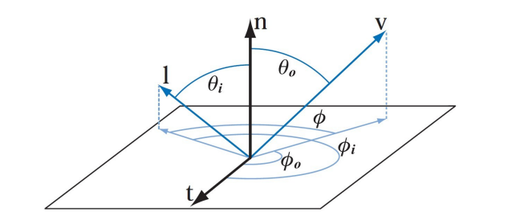
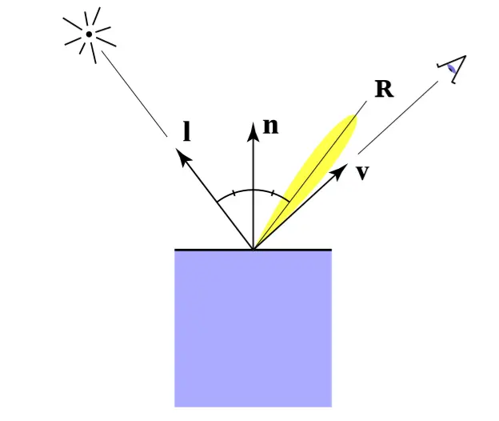

# 辐射度量学

辐射能量$Q$是辐射出的电磁能力，单位焦耳$J$

辐射通量$\Phi$又称辐射功率，是单位时间辐射的能量，单位瓦特$W$或者流明$\text{lm}$，通常使用辐射通量来衡量亮度，例如$80W$的灯泡。
$$
\Phi = \frac{dQ}{dt}
$$

辐射强度$I$是从光源发出的每单位立体角上的功率。立体角是圆的弧度在三维空间球上的扩展概念，单位${W} \cdot {sr}^{-1}$

对于二维的圆来说，弧度与角度的关系式为$\theta = \frac{l}{r}$，因此二维圆的弧度为$2\pi r$。

扩展到三维球体，立体角与投影在球体表面的面积相关，三维球体的立体角定义为$\Omega= \frac{A}{r^2}$，球体的立体角为$4\pi$。

微分立体角在球面上的投影面积可以近似为矩形，矩形的长宽是两个扇面的弧长。

$$
d\omega = \frac{dA}{r^2} = \frac{rd\theta \cdot r\sin\theta d\phi}{r^2} = \sin \theta d\theta d\phi
$$

既然$d\omega$是球的微分立体角，那么对其在球上进行积分应该能得到$4\pi$。将球面积分展开为二重积分，方位角$\phi$取值范围$[0,2\pi]$，天顶角$\theta$取值范围$[0,\pi]$。

$$
\Omega = \int_{S^2}d\omega = \int^{2\pi}_{0}\int^{\pi}_{0}\sin \theta d\theta d\phi
$$

首先计算出方位角的积分得到2，再对天顶角进行积分：
$$
\int^{\pi}_{0}\sin \theta d\theta \ = \left[-\cos\theta\right]_0^{\pi}=2
$$

$$
\Omega = 2\left[\phi\right]_0^{2\pi} \ = 2(2\pi - 0) \ = 4\pi
$$

则单位立体角的辐射功率，即辐射强度可以表示为
$$
I = \frac{d\Phi}{d\omega} = \frac{d\Phi}{sin \theta d\theta d\phi}
$$

辐射率，光亮度，radiance，表示物体表面沿着某方向的明亮程度。从物体表面上的单位面积出发，沿着指定方向上投影到球面则可以得到其单位投影面积$Area = A\cos \theta$

因此每单位立体角，每单位投影面积上的辐射功率，单位$W \cdot sr^{-1} \cdot m^{-2}$，即对辐射强度在单位面积上再次微分。
$$
L=\frac{d^{2} \Phi}{\cos \theta d A d \omega}
$$
辐照度Irradiance是入射光的辐射率在半球上的积分，或者说是单位面积在半球上接收到的所有的能量。
$$
E = \int_{\Omega} L(\omega) cos \theta d\omega 
= \int_{\Omega}\frac{d^{2} \Phi}{\cos \theta d A d \omega} cos \theta d\omega
= \frac{d\Phi}{dA}
$$
## BRDF

brdf用于描述物体表面如何反射光线。其定义是出射radiance的微分与入射irradiance的微分之比。对于入射光，半球面所有方向的入射光都有可能从指定的反射方向出射，给定了入射方向和出射方向的相对量，其单位是$s^{-1}$

### Lambert 漫反射模型

入射光线从入射点向半球面各个方向反射，且不同方向反射强度均匀相等。

对于入射光，需要考虑其入射角度造成接收到的入射光强度的损失。

并随着距离的增加，单位面积接收到光线的强度会平方衰减
$$
L_{d}=k_{d}\left(I / r^{2}\right) \max (0, \mathbf{n} \cdot \mathbf{l})
$$

### Phong模型

在光滑平面上，入射角度将与出射角度相同。由于出射=方向的分布极为狭窄，只有当视线与出射方向很近时才能看到反射光，当视线原理出射方向反射光会指数级衰减
$$
L_{s}=k_{s}\left(I / r^{2}\right) \max (0, \cos \alpha)^{p}
$$
使用距离的平方作为衰减项不符合人眼的实际感受，为了模拟人的视觉效果，可以对衰减项引入常数项和线性项。至于各项系数的取值，这属于经验数值，可以查表得到。
$$
F_{att}=\frac{1}{K_{c}+K_{l} * r+K_{q} * r^{2}}
$$

反射方向的计算也很简单，设反射方向 $R$ ，光源方向 $L$ ，法线方向 $N$ 。三者都是归一化后的单位向量，则可以计算出反射方向。
$$
R = V - 2*(V \cdot N)  *N
$$
Phong 模型在分为环境光、漫反射项和高光项。其中环境光可以视为平行光，只需要计算一定比例的光照强度即可。
$$
L = L_a+L_d+L_s
$$

## Blinn-Phong 光照模型

Phong 模型在计算高光项时，使用反射方向和观察方向的夹角余弦，而 Blinn-Phong 模型在计算高光项时，先计算出入射方向和观察方向的半程向量（单位化的二者之和向量），然后计算半程向量和法向量的夹角余弦。
$$
H = \frac{V+L}{\left\| V+L \right\|}
$$

半程向量与表面法线的夹角通常会小于观察方向和反射方向的夹角，如果要使两个模型呈现类似的效果，就需要在 Blinn-Phong 模型设置反光度为 Phong 模型的 $2$ 到 $4$ 倍。
$$
L_{specular} = k_s \frac{I}{D^2}\max{(0,N \cdot H)}^{p}
$$

对于在 GPU 中进行计算的 shader 程序，计算反射方向是一个耗费性能的行为，半程向量则只需要计算一次向量加法和一次向量单位化。

当出现观察方向与反射方向夹角大于 $90$ 度，此时高光项分量为 $0$ ，对于漫反射这是合理的，入射角和法线夹角超过 $90$ 度说明入射光在物体表面之下，而对于镜面反射，Phong 光照模型测量的是观察方向和反射方向的夹角，当出现物体反光度很小（粗糙）的时候，产生的高光半径就很大，就不能忽略这种角度下的高光项的贡献了。

体积云