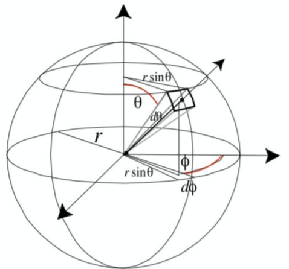

# 辐射度量学

辐射能量$Q$是辐射出的电磁能力，单位焦耳J

辐射通量$\Phi$又称辐射功率，是单位时间辐射的能量，单位瓦特$W$或者流明$lm$，通常使用辐射通量来衡量亮度，例如$80W$的灯泡。
$$
\Phi = \frac{dQ}{dt}
$$

辐射强度$I$是从光源发出的每单位立体角上的功率。立体角是圆的弧度在三维空间球上的扩展概念，单位$\frac{W}{sr}$
$$
I = \frac{d\Phi}{d\omega}
$$
对于二维的圆来说，弧度与角度的关系式为$\theta = \frac{l}{r}$，因此二维圆的弧度为$2\pi r$。

扩展到三维球体，立体角与投影在球体表面的面积相关，三维球体的立体角定义为$\Omega= \frac{A}{r^2}$，球体的立体角为$4\pi$。

微分立体角在球面上的投影面积可以近似为矩形，矩形的长宽是两个扇面的弧长。
$$
d\omega = \frac{dA}{r^2} = \frac{rd\theta \cdot r\sin\theta d\phi}{r^2} = \sin \theta d\theta d\phi
$$
既然$d\omega$是球的微分立体角，那么对其在球上进行积分应该能得到$4\pi$。将球面积分展开为二重积分，方位角$\phi$取值范围$[0,2\pi]$，天顶角$\theta$取值范围$[0,\pi]$。
$$
\Omega = \int_{S^2}d\omega = \int^{2\pi}_{0}\int^{\pi}_{0}\sin \theta d\theta d\phi
$$

首先计算出方位角的积分得到2，再对天顶角进行积分：
$$
\int^{\pi}_{0}\sin \theta d\theta \ = \left[-\cos\theta\right]_0^{\pi}=2
$$

$$
\Omega = 2\left[\phi\right]_0^{2\pi} \ = 2(2\pi - 0) \ = 4\pi
$$

什么是渲染方程

BRDF
菲涅尔项的F0 
PBR的实现需要哪些参数
光线追踪，路径追踪是 
什么是蒙特卡洛积分方法 