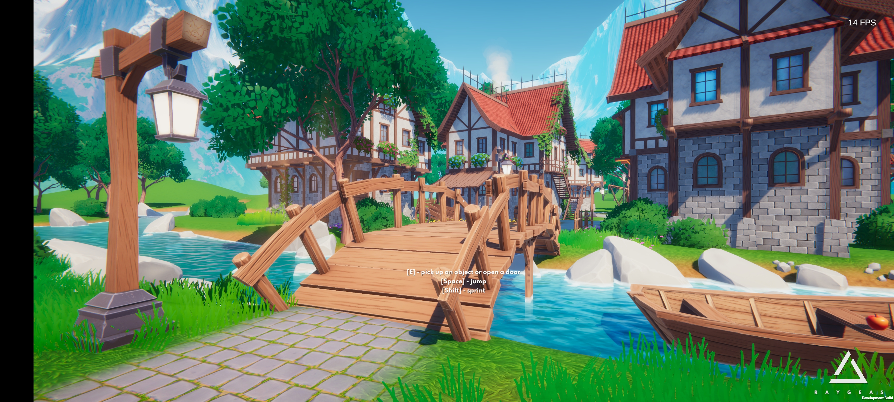

# Niagara性能分析工具
## 静态性能分析
静态分析工具以插件的形式提供，主要通过继承静态函数扩展类，把分析调用的接口暴露给蓝图或者脚本。同py脚本设置为启动引擎自动执行，将结果保存在json中，接入腾讯的自动化流水线。
引擎组为美术提供一些资产制作规范以及母材质，溶解遮罩等
例如
纹理大小原则上不能超过515x512
纹理的个数不能超过6张
如果资产使用了过多的母材质提供的功能，回迅速带来采样个数和gpu指令数的增加

粒子发射器的个数不超过15个

粒子的发射个数在pc端不超过100，移动端不超过25

使用mesh renderer的mesh使用高模有很大的性能开销。
如果是透明的材质，renderer的面积过大会造成严重的overdraw

## 动态性能分析

需求：想要对美术制作的Niagara资产进行规范和针对性优化
痛点：insight，包括市面上的性能分析工具只能评估整体的性能消耗，无法做到粒子发射器粒度的性能统计。
解决：通过对insight的改造，将数据到处，再进行二次分析，对于每个niagara的粒子发射器在运行时的总开销进行统计和排行。得到了生命周期中总开销最大的粒子发射器，我们就可以快速定位，让美术去调整去优化。

首先我们通过Unreal Insight分析Niagara在CPU和GPU上的耗时
发现在GameThread主要是在第一次初始化Niagara是会耗费较多时间
在渲染线程，Niagara资产名就是timeline上的节点名

对于第二点，我们希望能统计所有Niagara的特定场景中的总耗时
动态性能分析需要修改UE的Insight源码。在打开utrace文件时，insight会另起一个线程以解析文件，定位到相关代码后，出找出感兴趣的数据以特定的格式保存起来。
这些数据是按照timeline排列的，类似一个树形结构，我们只保留构建timeline必须的进出时间和id。然后使用py脚本解析这些数据，重建timeline的数据结构，找到Niagara相关的部分，在数据中统计这些数据，这样就得到了场景中的特效在一段时间内的时间开销。

# UE项目性能优化
## 行为树
在项目进行100只怪物的同屏测试时发现有明显掉帧，通过state unit命令发现是cpu的耗时很高，经过unreal insight的分析发现是ai行为树调用的函数耗时很高，但是具体是哪些方法无法确定。对行为树进行排查后发现是寻敌逻辑实现的问题。建议客户端把getactorbyactor的机制改为玩家池后从6.ms降低到了3.ms，另外寻敌逻辑是不需要tick执行的，将寻敌改写为service节点后，减少tick后降低到了1.ms。
## 渲染
某次打包实机时手机端很卡，经过分析是gpu端的压力，排查后发现是因为美术实现的悬崖风沙效果，原理是制作了一个全场景覆盖的面片，在材质里通过motion texture和uv偏移实现的风沙移动、随机透明度、颜色等，在PC上影响不大，但是在移动端上gpu架构的不同，风沙纹理有大面积的透明像素，需要回读system memory上的framebuffer，来做透明度混合，这会大幅降低性能，最后通过将全场景覆盖的大面片改为多个预制的小面片，减少透明像素覆盖的tile数量，以及做一些LOD分级，移动端不采样噪声纹理不做随机处理。纹理来获取随机值，为了减少该效果的开销，设置了移动端直接返回1，减少纹理的采样数量。

# Unity SRP
## 延迟渲染管线
## PBR/IBL
## ShadowMap/CSM

# URP性能优化
SUNTAIL-Stylized Fantasy Village
URP-Optimization
## 初步测试
移动平台-安卓-Redmi K60 实际测试数据
- 三角形数量1.5M-2M，峰值2.3M
- 渲染批次在1.5k-1.8k
- SetPassCall数200+
- 包体积：560MB左右
- 每帧耗时65ms左右，帧率12fps左右
- 显存占用1GB左右
	- RT占用约300MB
	- Mesh占用422MB
	- 纹理占用386MB
	- 音效资源75MB

## 静态资源优化
使用unity asset checker检查静态资源
设置force to mono 单声道
减少音频采样率，移动平台一般为22050hz
经过设置后音频运行时占用从75MB
纹理。大小限制，纯色纹理

## 渲染流程分析
SSAO

| 策略                   | 低负载 | 平均  | 高负载 |
| ---------------------- | ------ | ----- | ------ |
| 关闭                   |        | 28-30 |        |
| 开启+10sp              |        | 10-12 |        |
| 降采样1/4+10sp         |        | 18-20 |        |
| 降采样1/16All+10sp     | 26-28  | 22-24 | 20     |
| 降采样1/16All+4sp      |        | 24-26 |        |
| Mipmap拟合高斯模糊+4sp |        |   24-26    |        |

关闭SSAO
高斯模糊SSAO
Mipmap拟合高斯模糊SSAO

